# 🎧 AudioGo — Product Requirements Document (PRD)

> **Hệ Thống Thuyết Minh Du Lịch Đa Ngôn Ngữ**  
> *Dự án kỹ thuật số hóa Phố Ẩm Thực Vĩnh Khánh, Quận 4, TP.HCM*  
> *Cập nhật: 10/04/2026*

---

## Mục lục

1. [Giới Thiệu Chung](#-1-giới-thiệu-chung-executive-summary)
2. [Phân Quyền & Đối Tượng Người Dùng](#-2-phân-quyền--đối-tượng-người-dùng-user-roles)
3. [User Stories & Yêu Cầu Chức Năng](#-3-user-stories--yêu-cầu-chức-năng-functional-requirements)
4. [Yêu Cầu Phi Chức Năng](#%EF%B8%8F-4-yêu-cầu-phi-chức-năng-non-functional-requirements)
5. [Technology Stack & Kiến Trúc Hệ Thống](#%EF%B8%8F-5-technology-stack--kiến-trúc-hệ-thống)
6. [Cơ Sở Dữ Liệu](#%EF%B8%8F-6-cơ-sở-dữ-liệu-database-schema)
7. [Danh Mục API Routes](#-7-danh-mục-api-routes-net-core)
8. [Web CMS — Cấu Trúc Trang](#%EF%B8%8F-8-web-cms--cấu-trúc-trang-react-routes)
9. [Sơ Đồ Usecase](#-9-sơ-đồ-usecase-use-case-diagrams)
10. [Sơ Đồ Lớp (Class Diagrams)](#-10-sơ-đồ-lớp-class-diagrams)
11. [Sơ Đồ Trình Tự (Sequence Diagrams)](#-11-sơ-đồ-trình-tự-sequence-diagrams)
12. [Sơ Đồ Hoạt Động (Activity Diagrams)](#-12-sơ-đồ-hoạt-động-activity-diagrams)

---

## 📅 1. GIỚI THIỆU CHUNG (EXECUTIVE SUMMARY)

**AudioGo** là nền tảng số hóa trải nghiệm du lịch thông qua âm thanh (Audio-Guided Tour). Dự án áp dụng mô hình Client-Server để cung cấp chức năng phát âm thanh tự động dựa trên vị trí địa lý (Geofencing) trên Mobile App dành cho du khách, kết hợp với Web CMS quản trị đa ngôn ngữ và phân tích dữ liệu chuyên sâu dành cho Ban quản lý (Admin) và Chủ cửa hàng (POI Owner).

**Hệ thống bao gồm 3 thành phần chính:**

| Thành phần | Công nghệ | Trạng thái |
| :--- | :--- | :--- |
| **Backend API** | ASP.NET Core 10, EF Core 9, SQL Server | ✅ Hoàn thiện |
| **Mobile App** | .NET MAUI (Android) | ✅ Hoàn thiện |
| **Web CMS** | React 19, Vite 6, TailwindCSS | ✅ Hoàn thiện |

Mục tiêu tài liệu này (PRD) là đóng vai trò **"nguồn sự thật duy nhất" (Single Source of Truth)** chuẩn hóa mọi yêu cầu nghiệp vụ (Business Requirements), yêu cầu chức năng (Functional Requirements), API routes, sơ đồ UML, và tiêu chí nghiệm thu (Acceptance Criteria).

---

## 👥 2. PHÂN QUYỀN & ĐỐI TƯỢNG NGƯỜI DÙNG (USER ROLES)

| Vai trò (Actor) | Nền tảng | Quyền hạn (Permissions) | Xác thực |
| :--- | :--- | :--- | :--- |
| **Du khách (Guest)** | Mobile App | Xem bản đồ, quét QR kích hoạt, tự động nghe Audio khi đi vào hàng rào ảo, tìm kiếm/lọc POI, xem Tour. | Quét mã QR → JWT `GuestApp` (7 ngày) |
| **Chủ quán (POI Owner)** | Web CMS | Xem/Thêm/Sửa POI của mình, upload media. | JWT Bearer (`Owner`) |
| **Admin Hệ thống** | Web CMS | Toàn quyền: CRUD POI, Account, Category, Tour. Chạy Content Pipeline. Xem Dashboard Analytics. | JWT Bearer (`Admin`) |

---

## 📚 3. USER STORIES & YÊU CẦU CHỨC NĂNG (FUNCTIONAL REQUIREMENTS)

### Epic 1: Trải Nghiệm Khám Phá Của Du Khách (Mobile App — .NET MAUI)

**US 1.1 — Xác Thực QR Code (App Access)**
> *Là một Du khách, tôi muốn quét mã QR được cấp để kích hoạt quyền truy cập ứng dụng trong 7 ngày.*
- **FR:**
  - Mobile gửi `POST /api/mobile/auth/scan-qr` với `{ code, deviceId }`.
  - Backend kiểm tra `AppAccessCodes`: mã chưa dùng → kích hoạt, gán `DeviceId`, đặt `ExpireAt = +7 ngày`.
  - Mã đã dùng bởi thiết bị khác → `403 Forbid`. Mã hết hạn → `403 Forbid`.
  - Trả về JWT token role `GuestApp`.
- **AC:**
  - [x] Quét QR lần đầu: Kích hoạt thành công, ứng dụng hoạt động bình thường.
  - [x] Quét QR bằng thiết bị khác: Bị từ chối.
  - [x] Quét QR sau 7 ngày: Bị từ chối, cần mã mới.

**US 1.2 — Nhận Diện Hàng Rào Ảo (Geofencing Audio)**
> *Là một Du khách, tôi muốn ứng dụng tự động phát đoạn thuyết minh khi tôi đi bộ gần tới một POI.*
- **FR:**
  - Sử dụng công thức **Haversine** để tính khoảng cách định kỳ.
  - Kích hoạt Audio khi `Current Distance <= POI.ActivationRadius`.
  - Chỉ phát POI có `IsActive = true`.
- **AC:**
  - [x] App nhận diện thành công trong vòng tối đa 2-3 giây.
  - [x] Audio tự động phát mượt mà (nếu đã preload xuống SQLite).
  - [x] Ưu tiên POI có `Priority` cao nhất nếu chồng hàng rào.

**US 1.3 — Cơ Chế Chống Spam (Anti-spam / Cooldown)**
> *Là một Du khách, tôi không muốn điện thoại lặp lại cùng một audio khi đứng sát ranh giới.*
- **FR:** Cooldown **5 phút** cho mỗi POI ID tính từ thời điểm audio bắt đầu phát.
- **AC:**
  - [x] Ra vào lại trong 5 phút → Không phát lại. Vào sau phút thứ 6 → Phát lại bình thường.

**US 1.4 — Tìm Kiếm & Lọc POI**
> *Là Du khách, tôi muốn tìm kiếm quán ăn theo tên hoặc lọc theo danh mục.*
- **FR:**
  - `GET /api/mobile/pois?lang=vi&q=hải+sản&category=Hải Sản`
  - `GET /api/mobile/categories`
- **AC:**
  - [x] Kết quả trả về đúng ngôn ngữ (`lang` param). Filter category hoạt động chính xác.

**US 1.5 — Mini-Player & Xem Chi Tiết POI**
> *Là Du khách, tôi muốn nghe audio qua mini-player và xem chi tiết quán (gallery ảnh, mô tả).*
- **FR:**
  - `GET /api/mobile/pois/{poiId}?lang=vi` — chi tiết kèm content theo ngôn ngữ.
  - Mini-Player với Play/Pause/Seek, gallery ảnh carousel.
- **AC:**
  - [x] Audio phát mượt mà, thanh progress hiển thị. Gallery ảnh vuốt ngang.

**US 1.6 — Xem Tour (Lộ Trình Tham Quan)**
> *Là Du khách, tôi muốn xem các Tour và đi theo lộ trình gợi ý.*
- **FR:**
  - `GET /api/mobile/tours?lang=vi` — danh sách tour.
  - `GET /api/mobile/tours/{tourId}?lang=vi` — chi tiết tour: steps kèm POI info + audio.
- **AC:**
  - [x] Hiển thị lộ trình theo `StepOrder`. Nội dung đúng ngôn ngữ.

**US 1.7 — Đồng Bộ Offline-First**
> *Là Du khách, tôi muốn ứng dụng vẫn hoạt động khi mất kết nối internet.*
- **FR:**
  - `SyncService` đồng bộ toàn bộ POI (`IsActive = true`) xuống SQLite.
  - Geofencing + Audio playback hoạt động offline sau sync đầu.
- **AC:**
  - [x] App offline sau lần mở đầu. Có mạng → tự sync dữ liệu mới.

**US 1.8 — Ghi Nhận Hành Vi (Analytics Passive)**
> *Mobile âm thầm ghi nhận lịch sử nghe và vị trí GPS.*
- **FR:**
  - `POST /api/mobile/listen-history` — ghi nhận lịch sử nghe (`DeviceId`, `PoiId`, `ListenDuration`).
  - `POST /api/mobile/location-log` — batch GPS log (offline buffer flush).
- **AC:**
  - [x] Buffer local khi offline, flush khi có mạng. Admin xem được qua Dashboard.

---

### Epic 2: Quản Lý Nội Dung (Web CMS — POI Owner)

**US 2.1 — Đăng Nhập CMS**
> *Là Chủ Quán, tôi muốn đăng nhập CMS để quản lý POI.*
- **FR:**
  - `POST /api/auth/login` → JWT token. Redirect theo role → `/pois`.
- **AC:**
  - [x] Đăng nhập thành công hiện sidebar tương ứng role. Sai → thông báo lỗi.

**US 2.2 — Xem & Thêm POI**
> *Là POI Owner, tôi muốn xem danh sách và tạo mới POI.*
- **FR:**
  - `GET /api/cms/pois` — danh sách POI.
  - `POST /api/cms/pois` — tạo POI mới.
  - Upload logo qua `POST /api/cms/upload/image` trước.
- **AC:**
  - [x] Tạo POI thành công, hiện trong danh sách. Logo upload lên Azure Blob.

**US 2.3 — Quản Lý Nội Dung Đa Ngôn Ngữ**
> *Là POI Owner, tôi muốn nhập nội dung thuyết minh và quản lý bản dịch.*
- **FR:**
  - `GET/POST/PUT/DELETE /api/cms/pois/{poiId}/content` — CRUD content.
  - Khi sửa bản Master (`IsMaster = true`), tự động xóa tất cả Slave (buộc re-generate).
- **AC:**
  - [x] Master thay đổi → Slave bị xóa. Chạy lại Pipeline để gen mới.

**US 2.4 — Upload Media**
> *Là POI Owner, tôi muốn upload audio hoặc ảnh gallery.*
- **FR:**
  - `POST /api/cms/upload/audio` — max **50MB** (mp3/wav/ogg/m4a/aac).
  - `POST /api/cms/upload/image` — max **10MB** (jpg/png/webp/gif).
  - `POST/DELETE /api/cms/pois/{poiId}/gallery` — quản lý gallery.
- **AC:**
  - [x] File lên Azure Blob, trả URL. Sai định dạng → 400.

---

### Epic 3: Hệ Thống Quản Trị Toàn Diện (Web CMS — Admin)

**US 3.1 — Dashboard Tổng Quan**
> *Là Admin, tôi muốn xem thống kê tổng quan.*
- **FR:**
  - `GET /api/cms/analytics/top-pois?top=10` — Top N POI nghe nhiều nhất.
  - `GET /api/cms/analytics/heatmap` — Heatmap vị trí (~100m grid).
- **AC:**
  - [x] Dashboard hiển thị dữ liệu chính xác. Top POI kèm tên (join PoiContent).

**US 3.2 — Quản Lý Tài Khoản (CRUD)**
> *Là Admin, tôi muốn tạo/sửa/khóa/xóa tài khoản Owner.*
- **FR:**
  - `GET/POST/PUT/DELETE /api/cms/accounts` — CRUD account. Password hash **BCrypt**.
- **AC:**
  - [x] Trùng username → 400. Khóa → Owner không đăng nhập được.

**US 3.3 — Quản Lý Danh Mục (Category)**
> *Là Admin, tôi muốn CRUD danh mục và gán/bỏ gán POI.*
- **FR:**
  - `GET/POST/PUT/DELETE /api/cms/categories` — CRUD danh mục.
  - `POST/DELETE /api/cms/categories/{id}/pois` — gán/bỏ POI.
- **AC:**
  - [x] Hiển thị `PoiCount`. Mobile lấy qua `GET /api/mobile/categories`.

**US 3.4 — Quản Lý Tour**
> *Là Admin, tôi muốn thiết kế Tour tham quan.*
- **FR:**
  - `GET/POST/PUT/DELETE /api/cms/tours` — CRUD tour.
  - `POST/DELETE /api/cms/tours/{id}/pois` — thêm/xóa POI.
  - `PUT /api/cms/tours/{id}/pois/{poiId}/order` — đổi thứ tự bước.
- **AC:**
  - [x] Tour hiển thị đúng thứ tự `StepOrder`. Mobile lấy chi tiết kèm audio.

**US 3.5 — Content Pipeline: Dịch Thuật & Âm Thanh Tự Động**
> *Là Admin, tôi muốn hệ thống tự động dịch và tạo audio cho 7 ngôn ngữ.*
- **FR — 3 cấp độ Pipeline:**

| Endpoint | Mô tả | Scope |
| :--- | :--- | :--- |
| `POST /api/cms/pipeline/generate/{poiId}` | Generate audio cho 1 POI — tất cả ngôn ngữ đang có content. | Đơn lẻ |
| `POST /api/cms/pipeline/generate-all` | Generate audio cho tất cả content thiếu AudioUrl (POI `IsActive`). | Batch Audio |
| `POST /api/cms/pipeline/generate-all-languages` | **Full Pipeline**: Dịch + TTS cho **7 ngôn ngữ** × tất cả Active POI. | Bulk Full |
| `GET /api/cms/pipeline/status` | Kiểm tra trạng thái content/audio. | Monitoring |

- **Quy trình Bulk Pipeline (`generate-all-languages`):**
  1. Lấy tất cả POI có `IsActive = true` kèm Contents.
  2. Mỗi POI × mỗi ngôn ngữ (`vi, en, ja, ko, zh-Hans, fr, th`):
     - `EnsureContentAsync()`: Chưa có → dịch từ Master (Azure Translator) → tạo record.
     - Thiếu `AudioUrl` → `GenerateAudioAsync()`: TTS → MP3 → Upload Blob → cập nhật.
- **AC:**
  - [x] 7 ngôn ngữ × N POI đều có content + audio.
  - [x] Response: `{ successCount, failCount, results[] }`.

---

## ⚙️ 4. YÊU CẦU PHI CHỨC NĂNG (NON-FUNCTIONAL REQUIREMENTS)

| Tiêu chí | Mô tả Yêu cầu (NFR) |
| :--- | :--- |
| **Bảo mật (Security)** | Web CMS: **JWT Bearer** (BCrypt hash). Mobile: QR → JWT `GuestApp`. CORS tách riêng `WebCmsPolicy` / `MobilePolicy`. |
| **Sẵn sàng (Availability)** | Mobile: **Offline-First** (SQLite). Geofencing + Audio hoạt động không cần mạng. |
| **Hiệu năng (Performance)** | Content Pipeline chạy tuần tự (sequential). Response chi tiết success/fail. |
| **Đa Ngôn Ngữ (i18n)** | **7 ngôn ngữ**: `vi`, `en`, `ja`, `ko`, `zh-Hans`, `fr`, `th`. |
| **Maps** | Mobile: **Google Maps SDK**. CMS (tương lai): **Leaflet JS** cho Heatmap. |
| **Upload Limits** | Audio: **50MB** max. Image: **10MB** max. |

---

## 🏗️ 5. TECHNOLOGY STACK & KIẾN TRÚC HỆ THỐNG

### 5.1. Thành Phần Hệ Thống

| Layer | Công nghệ | Chi tiết |
| :--- | :--- | :--- |
| **Backend API** | ASP.NET Core 10 (C#), EF Core 9 | Controllers: `api/cms/*` (🔒 JWT) + `api/mobile/*` |
| **Database** | SQL Server | 11 bảng |
| **Cloud – Audio** | Azure Text-To-Speech | Sinh MP3 từ text theo ngôn ngữ |
| **Cloud – Dịch** | Azure AI Translator | Dịch từ Master sang 6 ngôn ngữ |
| **Cloud – Lưu trữ** | Azure Blob Storage | `audiogo-audio`, `audiogo-images` |
| **Mobile App** | .NET MAUI (Android) | MVVM + SQLite + Google Maps SDK |
| **Web CMS** | React 19, Vite 6, TailwindCSS | SPA + React Router, role-based routing |

### 5.2. Sơ Đồ Kiến Trúc Tổng Quan

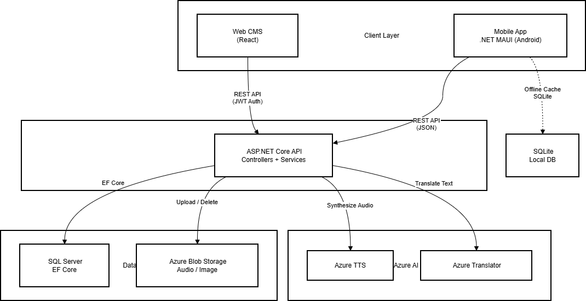

### 5.3. Sơ Đồ Cơ Sở Dữ Liệu (Schema & ERD)


### 5.4. Sơ Đồ Lớp Nghiệp Vụ (Class Diagram)


---

## 🗄️ 6. CƠ SỞ DỮ LIỆU (DATABASE SCHEMA)

> 11 bảng trong SQL Server — phản ánh chính xác `api/Models/`.

| Bảng | Mô tả | Khóa chính |
| :--- | :--- | :--- |
| `Account` | Tài khoản Admin/Owner (username, passwordHash, role, fullName, email, phoneNumber, isLocked) | `AccountId` |
| `AppAccessCode` | Mã QR xác thực Mobile (code, usedByDeviceId, activatedAt, expireAt) | `CodeId` |
| `Poi` | Điểm quan tâm (lat, lon, activationRadius, priority, status, isActive, logoUrl) | `PoiId` |
| `PoiContent` | Nội dung đa ngôn ngữ (languageCode, title, description, audioUrl, isMaster) | `ContentId` |
| `PoiGallery` | Ảnh gallery (imageUrl, sortOrder) | `ImageId` |
| `Category` | Danh mục (name) | `CategoryId` |
| `CategoryPoi` | Bảng nối N-N Category ↔ POI | `CategoryId + PoiId` |
| `Tour` | Tour tham quan (name, description, thumbnailUrl) | `TourId` |
| `TourPoi` | Bảng nối Tour ↔ POI (stepOrder) | `TourId + PoiId` |
| `ListenHistory` | Lịch sử nghe (deviceId, poiId, listenDuration, timestamp) | `HistoryId` |
| `LocationLog` | GPS log (deviceId, lat, lon, timestamp) | `LocationId` |

---

## 🔗 7. DANH MỤC API ROUTES (.NET CORE)

> API chia 3 nhóm route: **Auth**, **CMS** (🔒 JWT required), **Mobile**.

### 🔐 Authentication

| Method | Route | Mô tả |
| :--- | :--- | :--- |
| `POST` | `/api/auth/login` | Đăng nhập (CMS Admin/Owner) |
| `POST` | `/api/auth/register` | Đăng ký tài khoản |
| `POST` | `/api/auth/setup-dev` | [DEV] Tạo/reset admin account |

### 🌐 Web CMS APIs (🔒 JWT Bearer)

#### POI Management
| Method | Route | Mô tả |
| :--- | :--- | :--- |
| `GET` | `/api/cms/pois` | Danh sách POI |
| `GET` | `/api/cms/pois/{id}` | Chi tiết POI kèm content + gallery |
| `POST` | `/api/cms/pois` | Tạo POI mới |
| `PUT` | `/api/cms/pois/{id}` | Cập nhật POI |
| `DELETE` | `/api/cms/pois/{id}` | Xóa POI |

#### POI Content (Multilingual)
| Method | Route | Mô tả |
| :--- | :--- | :--- |
| `GET` | `/api/cms/pois/{poiId}/content` | Danh sách content |
| `POST` | `/api/cms/pois/{poiId}/content` | Thêm bản ngôn ngữ mới |
| `PUT` | `/api/cms/pois/{poiId}/content/{contentId}` | Sửa content |
| `DELETE` | `/api/cms/pois/{poiId}/content/{contentId}` | Xóa bản content |

#### POI Gallery
| Method | Route | Mô tả |
| :--- | :--- | :--- |
| `GET` | `/api/cms/pois/{poiId}/gallery` | Danh sách ảnh gallery |
| `POST` | `/api/cms/pois/{poiId}/gallery` | Thêm ảnh |
| `DELETE` | `/api/cms/pois/{poiId}/gallery/{imageId}` | Xóa ảnh |

#### Media Upload
| Method | Route | Mô tả |
| :--- | :--- | :--- |
| `POST` | `/api/cms/upload/audio` | Upload audio (50MB max) |
| `POST` | `/api/cms/upload/image` | Upload ảnh (10MB max) |

#### Account Management
| Method | Route | Mô tả |
| :--- | :--- | :--- |
| `GET` | `/api/cms/accounts` | Danh sách tài khoản |
| `GET` | `/api/cms/accounts/{id}` | Chi tiết tài khoản |
| `POST` | `/api/cms/accounts` | Tạo tài khoản mới |
| `PUT` | `/api/cms/accounts/{id}` | Cập nhật tài khoản |
| `DELETE` | `/api/cms/accounts/{id}` | Xóa tài khoản |

#### Category Management
| Method | Route | Mô tả |
| :--- | :--- | :--- |
| `GET` | `/api/cms/categories` | Danh sách danh mục |
| `GET` | `/api/cms/categories/{id}` | Chi tiết |
| `POST` | `/api/cms/categories` | Tạo danh mục |
| `PUT` | `/api/cms/categories/{id}` | Sửa |
| `DELETE` | `/api/cms/categories/{id}` | Xóa |
| `POST` | `/api/cms/categories/{id}/pois` | Gán POI |
| `DELETE` | `/api/cms/categories/{id}/pois/{poiId}` | Bỏ POI |

#### Tour Management
| Method | Route | Mô tả |
| :--- | :--- | :--- |
| `GET` | `/api/cms/tours` | Danh sách tour |
| `GET` | `/api/cms/tours/{id}` | Chi tiết tour |
| `POST` | `/api/cms/tours` | Tạo tour |
| `PUT` | `/api/cms/tours/{id}` | Sửa tour |
| `DELETE` | `/api/cms/tours/{id}` | Xóa tour |
| `POST` | `/api/cms/tours/{id}/pois` | Thêm POI (kèm stepOrder) |
| `DELETE` | `/api/cms/tours/{id}/pois/{poiId}` | Xóa POI |
| `PUT` | `/api/cms/tours/{id}/pois/{poiId}/order` | Đổi thứ tự bước |

#### Content Pipeline
| Method | Route | Mô tả |
| :--- | :--- | :--- |
| `POST` | `/api/cms/pipeline/generate/{poiId}` | Generate audio cho 1 POI |
| `POST` | `/api/cms/pipeline/generate-all` | Generate audio batch |
| `POST` | `/api/cms/pipeline/generate-all-languages` | **Full Pipeline**: Dịch + TTS × 7 langs |
| `GET` | `/api/cms/pipeline/status` | Trạng thái pipeline |

#### Analytics
| Method | Route | Mô tả |
| :--- | :--- | :--- |
| `GET` | `/api/cms/analytics/top-pois?top=N` | Top POI được nghe nhiều |
| `GET` | `/api/cms/analytics/heatmap` | Heatmap vị trí |

### 📱 Mobile APIs

| Method | Route | Mô tả |
| :--- | :--- | :--- |
| `POST` | `/api/mobile/auth/scan-qr` | Quét QR kích hoạt app |
| `GET` | `/api/mobile/pois?lang=vi` | Danh sách POI |
| `GET` | `/api/mobile/pois/nearby?lat=&lon=&radius=` | POI gần vị trí |
| `GET` | `/api/mobile/pois/{poiId}?lang=vi` | Chi tiết POI |
| `GET` | `/api/mobile/categories` | Danh sách danh mục |
| `GET` | `/api/mobile/tours?lang=vi` | Danh sách tour |
| `GET` | `/api/mobile/tours/{tourId}?lang=vi` | Chi tiết tour |
| `POST` | `/api/mobile/listen-history` | Ghi lịch sử nghe |
| `POST` | `/api/mobile/location-log` | Gửi batch GPS log |

---

## 🖥️ 8. WEB CMS — CẤU TRÚC TRANG (REACT ROUTES)

> Web CMS sử dụng React Router v6 với `ProtectedRoute` kiểm tra role JWT.

| Route | Trang | Quyền | Mô tả |
| :--- | :--- | :--- | :--- |
| `/` | `LoginPage` | Public | Đăng nhập CMS |
| `/dashboard` | `DashboardPage` | Admin, Owner | Tổng quan thống kê |
| `/pois` | `POIPage` | Admin, Owner | Danh sách POI + filter/search |
| `/pois/add` | `AddPOIPage` | Owner | Form tạo POI mới |
| `/pois/:id` | `POIDetailPage` | Admin, Owner | Chi tiết: content, gallery, pipeline |
| `/accounts` | `AccountsPage` | Admin | CRUD tài khoản |
| `/categories` | `CategoryPage` | Admin | CRUD danh mục |
| `/tours` | `ToursPage` | Admin | Danh sách tour |
| `/tours/:id` | `TourDetailPage` | Admin | Chi tiết tour: quản lý steps |
| `/audio` | `AudioPage` | Owner | Quản lý audio files |
| `/analytics` | — | Admin | Phân tích dữ liệu |

---

## 📊 9. SƠ ĐỒ USECASE (USE CASE DIAGRAMS)

### 9.1. Tổng Quan Usecase (Tất Cả Vai Trò)

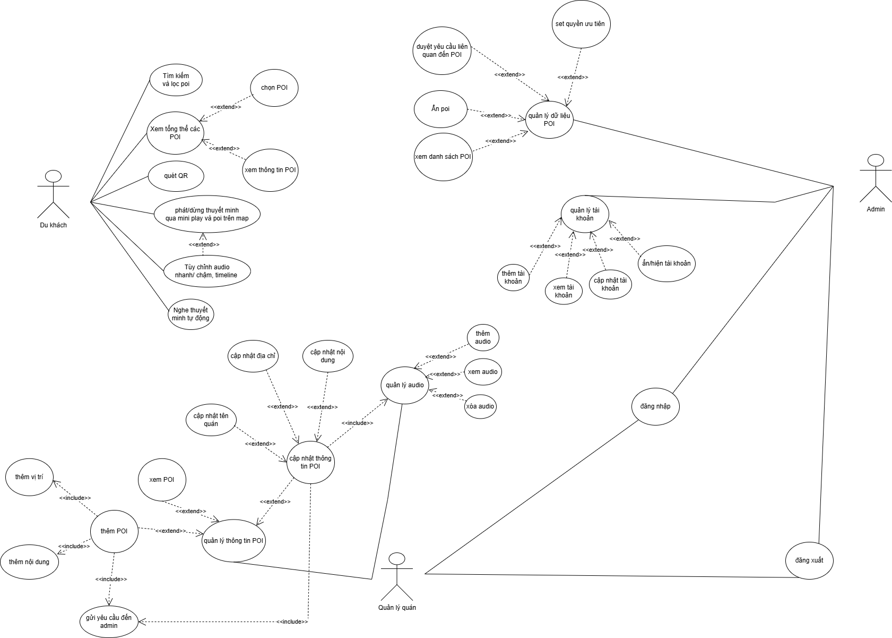

### 9.2. Usecase — Du Khách (Guest / Mobile User)

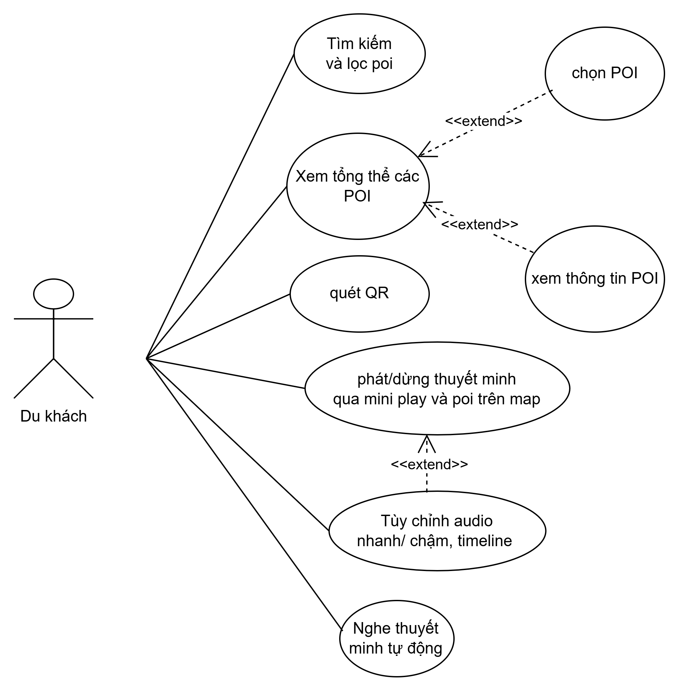

### 9.3. Usecase — Chủ Quán (POI Owner / Web CMS)

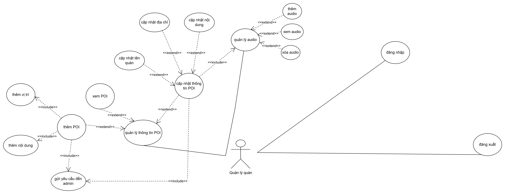

### 9.4. Usecase — Admin Hệ Thống (Web CMS)

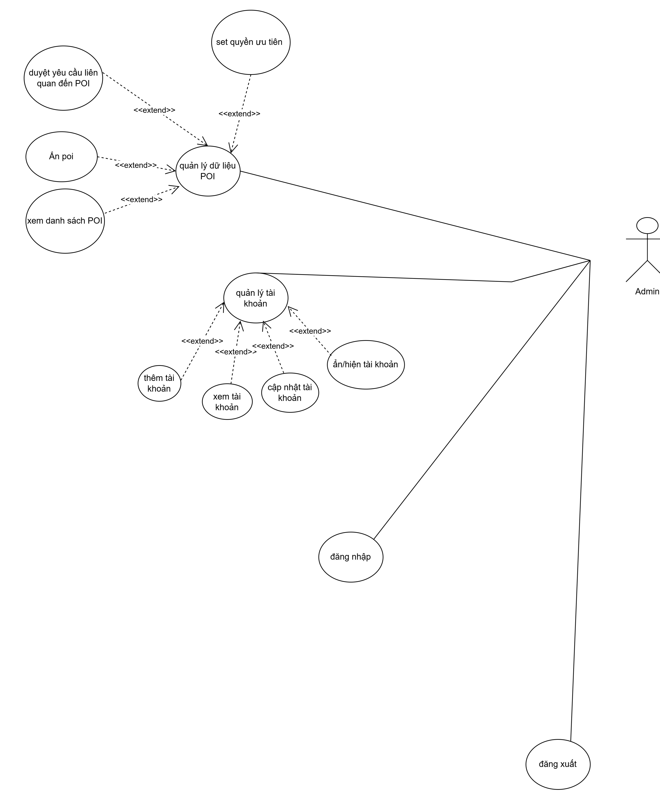

---

## 🧩 10. SƠ ĐỒ LỚP (CLASS DIAGRAMS)

### 10.1. Tổng Quan — Backend Entity & DTO (Overview)

> Sơ đồ rút gọn thể hiện 11 Entity + DTO chính và mối quan hệ.

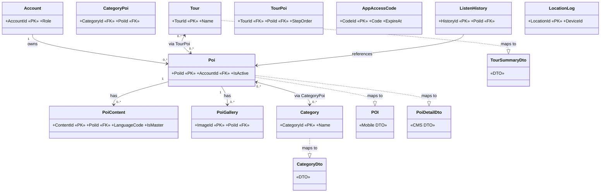
```mermaid
classDiagram
    direction TB
    class Account { +AccountId «PK» +Role }
    class Poi { +PoiId «PK» +AccountId «FK» +IsActive }
    class PoiContent { +ContentId «PK» +PoiId «FK» +LanguageCode +IsMaster }
    class PoiGallery { +ImageId «PK» +PoiId «FK» }
    class Category { +CategoryId «PK» +Name }
    class CategoryPoi { +CategoryId «FK» +PoiId «FK» }
    class Tour { +TourId «PK» +Name }
    class TourPoi { +TourId «FK» +PoiId «FK» +StepOrder }
    class AppAccessCode { +CodeId «PK» +Code +ExpireAt }
    class ListenHistory { +HistoryId «PK» +PoiId «FK» }
    class LocationLog { +LocationId «PK» +DeviceId }
    class POI { «Mobile DTO» }
    class PoiDetailDto { «CMS DTO» }
    class CategoryDto { «DTO» }
    class TourSummaryDto { «DTO» }

    Account "1" --> "0..*" Poi : owns
    Poi "1" --> "0..*" PoiContent : has
    Poi "1" --> "0..*" PoiGallery : has
    Poi "0..*" <--> "0..*" Category : via CategoryPoi
    Tour "0..*" <--> "0..*" Poi : via TourPoi
    ListenHistory --> Poi : references
    Poi ..|> POI : maps to
    Poi ..|> PoiDetailDto : maps to
    Category ..|> CategoryDto : maps to
    Tour ..|> TourSummaryDto : maps to
```

### 10.2. Tổng Quan — Backend Application Logic (Overview)

> Controllers → Services / Repositories → Data Layer.

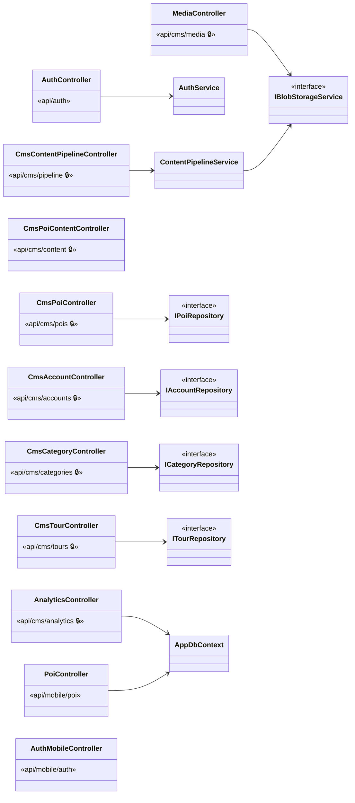
```mermaid
classDiagram
    direction LR
    class AuthController { «api/auth» }
    class CmsPoiController { «api/cms/pois 🔒» }
    class CmsPoiContentController { «api/cms/content 🔒» }
    class CmsContentPipelineController { «api/cms/pipeline 🔒» }
    class CmsAccountController { «api/cms/accounts 🔒» }
    class CmsCategoryController { «api/cms/categories 🔒» }
    class CmsTourController { «api/cms/tours 🔒» }
    class AnalyticsController { «api/cms/analytics 🔒» }
    class MediaController { «api/cms/media 🔒» }
    class PoiController { «api/mobile/poi» }
    class AuthMobileController { «api/mobile/auth» }

    class AuthService
    class ContentPipelineService
    class IBlobStorageService { <<interface>> }
    class IPoiRepository { <<interface>> }
    class IAccountRepository { <<interface>> }
    class ICategoryRepository { <<interface>> }
    class ITourRepository { <<interface>> }
    class AppDbContext

    AuthController --> AuthService
    CmsPoiController --> IPoiRepository
    CmsAccountController --> IAccountRepository
    CmsCategoryController --> ICategoryRepository
    CmsTourController --> ITourRepository
    CmsContentPipelineController --> ContentPipelineService
    MediaController --> IBlobStorageService
    AnalyticsController --> AppDbContext
    PoiController --> AppDbContext
    ContentPipelineService --> IBlobStorageService
```

### 10.3. Tổng Quan — Mobile Architecture (Overview)

> Kiến trúc MVVM: View → ViewModel → Service → Platform.

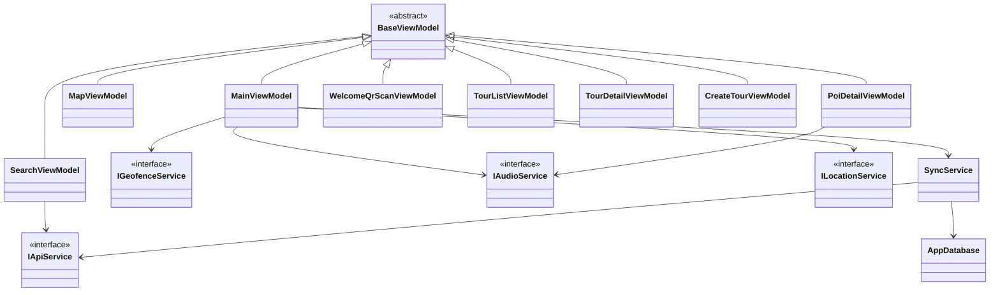
```mermaid
classDiagram
    direction TB
    class BaseViewModel { <<abstract>> }
    class MainViewModel
    class MapViewModel
    class SearchViewModel
    class PoiDetailViewModel
    class WelcomeQrScanViewModel
    class TourListViewModel
    class TourDetailViewModel
    class CreateTourViewModel

    class IApiService { <<interface>> }
    class IGeofenceService { <<interface>> }
    class IAudioService { <<interface>> }
    class ILocationService { <<interface>> }
    class SyncService
    class AppDatabase

    BaseViewModel <|-- MainViewModel
    BaseViewModel <|-- MapViewModel
    BaseViewModel <|-- SearchViewModel
    BaseViewModel <|-- PoiDetailViewModel
    BaseViewModel <|-- WelcomeQrScanViewModel
    BaseViewModel <|-- TourListViewModel
    BaseViewModel <|-- TourDetailViewModel
    BaseViewModel <|-- CreateTourViewModel

    MainViewModel --> SyncService
    MainViewModel --> IGeofenceService
    MainViewModel --> IAudioService
    MainViewModel --> ILocationService
    SearchViewModel --> IApiService
    PoiDetailViewModel --> IAudioService
    SyncService --> IApiService
    SyncService --> AppDatabase
```

---

### 10.4. Chi Tiết — Core Entities (Backend `api/Models/`)

> 11 Entity đầy đủ thuộc tính và mối quan hệ.

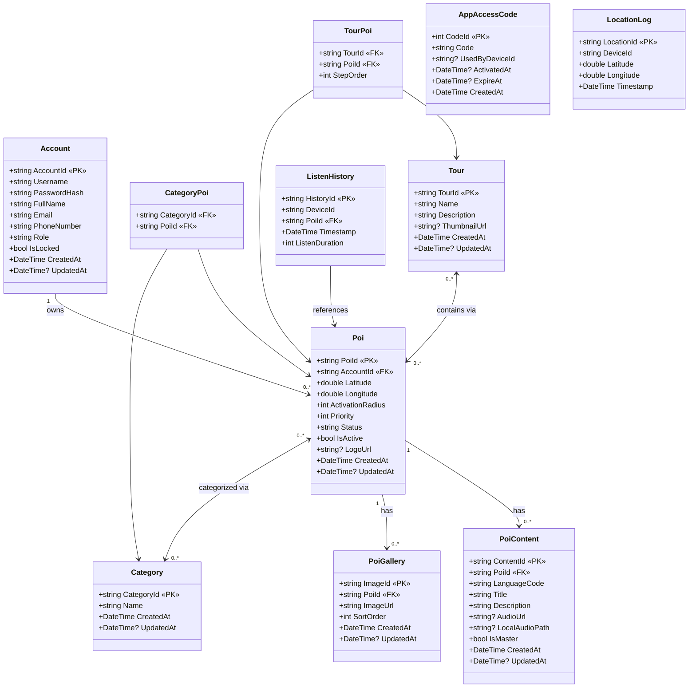
```mermaid
classDiagram
    direction TB

    class Account {
        +string AccountId «PK»
        +string Username
        +string PasswordHash
        +string FullName
        +string Email
        +string PhoneNumber
        +string Role
        +bool IsLocked
        +DateTime CreatedAt
        +DateTime? UpdatedAt
    }

    class Poi {
        +string PoiId «PK»
        +string AccountId «FK»
        +double Latitude
        +double Longitude
        +int ActivationRadius
        +int Priority
        +string Status
        +bool IsActive
        +string? LogoUrl
        +DateTime CreatedAt
        +DateTime? UpdatedAt
    }

    class PoiContent {
        +string ContentId «PK»
        +string PoiId «FK»
        +string LanguageCode
        +string Title
        +string Description
        +string? AudioUrl
        +string? LocalAudioPath
        +bool IsMaster
        +DateTime CreatedAt
        +DateTime? UpdatedAt
    }

    class PoiGallery {
        +string ImageId «PK»
        +string PoiId «FK»
        +string ImageUrl
        +int SortOrder
        +DateTime CreatedAt
        +DateTime? UpdatedAt
    }

    class Category {
        +string CategoryId «PK»
        +string Name
        +DateTime CreatedAt
        +DateTime? UpdatedAt
    }

    class CategoryPoi {
        +string CategoryId «FK»
        +string PoiId «FK»
    }

    class Tour {
        +string TourId «PK»
        +string Name
        +string Description
        +string? ThumbnailUrl
        +DateTime CreatedAt
        +DateTime? UpdatedAt
    }

    class TourPoi {
        +string TourId «FK»
        +string PoiId «FK»
        +int StepOrder
    }

    class AppAccessCode {
        +int CodeId «PK»
        +string Code
        +string? UsedByDeviceId
        +DateTime? ActivatedAt
        +DateTime? ExpireAt
        +DateTime CreatedAt
    }

    class ListenHistory {
        +string HistoryId «PK»
        +string DeviceId
        +string PoiId «FK»
        +DateTime Timestamp
        +int ListenDuration
    }

    class LocationLog {
        +string LocationId «PK»
        +string DeviceId
        +double Latitude
        +double Longitude
        +DateTime Timestamp
    }

    Account "1" --> "0..*" Poi : owns
    Poi "1" --> "0..*" PoiContent : has
    Poi "1" --> "0..*" PoiGallery : has
    Poi "0..*" <--> "0..*" Category : categorized via
    CategoryPoi --> Poi
    CategoryPoi --> Category
    Tour "0..*" <--> "0..*" Poi : contains via
    TourPoi --> Tour
    TourPoi --> Poi
    ListenHistory --> Poi : references
```

### 10.5. Chi Tiết — DTO Layer (`shared/DTOs/`)

> Tất cả Data Transfer Objects sử dụng bởi Mobile App và Web CMS.

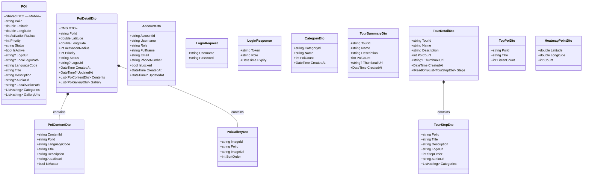
```mermaid
classDiagram
    direction TB

    class POI {
        «Shared DTO — Mobile»
        +string PoiId
        +double Latitude
        +double Longitude
        +int ActivationRadius
        +int Priority
        +string Status
        +bool IsActive
        +string? LogoUrl
        +string? LocalLogoPath
        +string LanguageCode
        +string Title
        +string Description
        +string? AudioUrl
        +string? LocalAudioPath
        +List~string~ Categories
        +List~string~ GalleryUrls
    }

    class PoiDetailDto {
        «CMS DTO»
        +string PoiId
        +double Latitude
        +double Longitude
        +int ActivationRadius
        +int Priority
        +string Status
        +string? LogoUrl
        +DateTime CreatedAt
        +DateTime? UpdatedAt
        +List~PoiContentDto~ Contents
        +List~PoiGalleryDto~ Gallery
    }

    class PoiContentDto {
        +string ContentId
        +string PoiId
        +string LanguageCode
        +string Title
        +string Description
        +string? AudioUrl
        +bool IsMaster
    }

    class PoiGalleryDto {
        +string ImageId
        +string PoiId
        +string ImageUrl
        +int SortOrder
    }

    class AccountDto {
        +string AccountId
        +string Username
        +string Role
        +string FullName
        +string Email
        +string PhoneNumber
        +bool IsLocked
        +DateTime CreatedAt
        +DateTime? UpdatedAt
    }

    class LoginRequest {
        +string Username
        +string Password
    }

    class LoginResponse {
        +string Token
        +string Role
        +DateTime Expiry
    }

    class CategoryDto {
        +string CategoryId
        +string Name
        +int PoiCount
        +DateTime CreatedAt
    }

    class TourSummaryDto {
        +string TourId
        +string Name
        +string Description
        +int PoiCount
        +string? ThumbnailUrl
        +DateTime CreatedAt
    }

    class TourDetailDto {
        +string TourId
        +string Name
        +string Description
        +int PoiCount
        +string? ThumbnailUrl
        +DateTime CreatedAt
        +IReadOnlyList~TourStepDto~ Steps
    }

    class TourStepDto {
        +string PoiId
        +string Title
        +string Description
        +string LogoUrl
        +int StepOrder
        +string AudioUrl
        +List~string~ Categories
    }

    class TopPoiDto {
        +string PoiId
        +string Title
        +int ListenCount
    }

    class HeatmapPointDto {
        +double Latitude
        +double Longitude
        +int Count
    }

    PoiDetailDto *-- PoiContentDto : contains
    PoiDetailDto *-- PoiGalleryDto : contains
    TourDetailDto *-- TourStepDto : contains
```

### 10.6. Chi Tiết — Backend Services (`api/Services/`)

> Service interfaces và implementations: Pipeline, Translation, TTS, Blob, Auth.

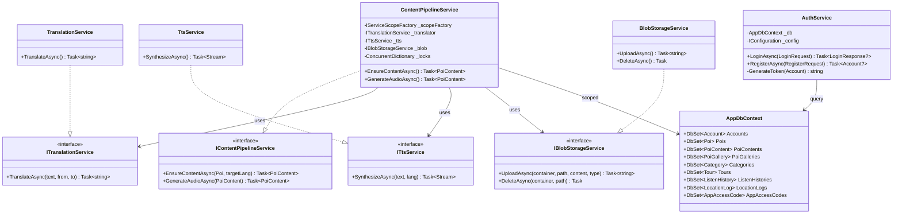
```mermaid
classDiagram
    direction TB

    class IContentPipelineService {
        <<interface>>
        +EnsureContentAsync(Poi, targetLang) Task~PoiContent~
        +GenerateAudioAsync(PoiContent) Task~PoiContent~
    }

    class ITranslationService {
        <<interface>>
        +TranslateAsync(text, from, to) Task~string~
    }

    class ITtsService {
        <<interface>>
        +SynthesizeAsync(text, lang) Task~Stream~
    }

    class IBlobStorageService {
        <<interface>>
        +UploadAsync(container, path, content, type) Task~string~
        +DeleteAsync(container, path) Task
    }

    class ContentPipelineService {
        -IServiceScopeFactory _scopeFactory
        -ITranslationService _translator
        -ITtsService _tts
        -IBlobStorageService _blob
        -ConcurrentDictionary _locks
        +EnsureContentAsync() Task~PoiContent~
        +GenerateAudioAsync() Task~PoiContent~
    }

    class TranslationService {
        +TranslateAsync() Task~string~
    }

    class TtsService {
        +SynthesizeAsync() Task~Stream~
    }

    class BlobStorageService {
        +UploadAsync() Task~string~
        +DeleteAsync() Task
    }

    class AuthService {
        -AppDbContext _db
        -IConfiguration _config
        +LoginAsync(LoginRequest) Task~LoginResponse?~
        +RegisterAsync(RegisterRequest) Task~Account?~
        -GenerateToken(Account) string
    }

    class AppDbContext {
        +DbSet~Account~ Accounts
        +DbSet~Poi~ Pois
        +DbSet~PoiContent~ PoiContents
        +DbSet~PoiGallery~ PoiGalleries
        +DbSet~Category~ Categories
        +DbSet~Tour~ Tours
        +DbSet~ListenHistory~ ListenHistories
        +DbSet~LocationLog~ LocationLogs
        +DbSet~AppAccessCode~ AppAccessCodes
    }

    ContentPipelineService ..|> IContentPipelineService
    TranslationService ..|> ITranslationService
    TtsService ..|> ITtsService
    BlobStorageService ..|> IBlobStorageService

    ContentPipelineService --> ITranslationService : uses
    ContentPipelineService --> ITtsService : uses
    ContentPipelineService --> IBlobStorageService : uses
    ContentPipelineService --> AppDbContext : scoped
    AuthService --> AppDbContext : query
```

### 10.7. Chi Tiết — Backend Controllers & Repositories

> Controllers + Repository interfaces: thể hiện luồng Controller → Repository → AppDbContext.


```mermaid
classDiagram
    direction TB

    class AuthController {
        «api/auth»
        +Login(LoginRequest) IActionResult
        +Register(RegisterRequest) IActionResult
        +SetupDev(LoginRequest) IActionResult
    }

    class PoiController {
        «api/mobile/poi»
        +GetAll(lang, lat, lon, radius) IActionResult
        +GetById(id, lang) IActionResult
    }

    class AuthMobileController {
        «api/mobile/auth»
        +ScanQr(code, deviceId) IActionResult
    }

    class CategoryMobileController {
        «api/mobile/category»
        +GetAll() IActionResult
    }

    class TourMobileController {
        «api/mobile/tour»
        +GetAll(lang, query) IActionResult
        +GetById(tourId, lang) IActionResult
    }

    class ListenHistoryController {
        «api/mobile/listen-history»
        +Post(dto) IActionResult
    }

    class LocationLogController {
        «api/mobile/location-log»
        +Post(dto) IActionResult
    }

    class CmsPoiController {
        «api/cms/pois 🔒»
        +GetAll(status) IActionResult
        +GetById(id) IActionResult
        +Create(dto) IActionResult
        +Update(id, dto) IActionResult
        +Delete(id) IActionResult
    }

    class CmsPoiContentController {
        «api/cms/content 🔒»
        +GetByPoi(poiId) IActionResult
        +Upsert(dto) IActionResult
    }

    class CmsPoiGalleryController {
        «api/cms/gallery 🔒»
        +Upload(poiId, file) IActionResult
        +Delete(imageId) IActionResult
    }

    class CmsAccountController {
        «api/cms/accounts 🔒»
        +GetAll() IActionResult
        +GetById(id) IActionResult
        +Create(req) IActionResult
        +Update(id, req) IActionResult
        +Delete(id) IActionResult
    }

    class CmsCategoryController {
        «api/cms/categories 🔒»
        +GetAll() IActionResult
        +Create(dto) IActionResult
        +Update(id, dto) IActionResult
        +Delete(id) IActionResult
        +AddPoi(catId, poiId) IActionResult
        +RemovePoi(catId, poiId) IActionResult
    }

    class CmsTourController {
        «api/cms/tours 🔒»
        +GetAll() IActionResult
        +GetById(id) IActionResult
        +Create(dto) IActionResult
        +Update(id, dto) IActionResult
        +Delete(id) IActionResult
        +AddPoi(tourId, poiId) IActionResult
        +RemovePoi(tourId, poiId) IActionResult
        +ReorderPoi(tourId, poiId, order) IActionResult
    }

    class CmsContentPipelineController {
        «api/cms/pipeline 🔒»
        +GenerateForPoi(poiId) IActionResult
        +GenerateAll() IActionResult
        +GenerateAllLanguages() IActionResult
        +GetPipelineStatus() IActionResult
    }

    class AnalyticsController {
        «api/cms/analytics 🔒»
        +GetTopPois(top) IActionResult
        +GetHeatmap() IActionResult
    }

    class MediaController {
        «api/cms/media 🔒»
        +Upload(file) IActionResult
        +Delete(url) IActionResult
    }

    class IPoiRepository { <<interface>> }
    class IAccountRepository { <<interface>> }
    class ICategoryRepository { <<interface>> }
    class ITourRepository { <<interface>> }
    class IListenHistoryRepository { <<interface>> }
    class ILocationLogRepository { <<interface>> }

    AuthController --> AuthService : uses
    CmsPoiController --> IPoiRepository : uses
    CmsAccountController --> IAccountRepository : uses
    CmsCategoryController --> ICategoryRepository : uses
    CmsTourController --> ITourRepository : uses
    CmsContentPipelineController --> IContentPipelineService : uses
    CmsContentPipelineController --> AppDbContext : query
    CmsPoiContentController --> AppDbContext : query
    CmsPoiGalleryController --> IBlobStorageService : upload
    AnalyticsController --> AppDbContext : query
    MediaController --> IBlobStorageService : uses
    PoiController --> AppDbContext : query
    AuthMobileController --> AppDbContext : query
    ListenHistoryController --> IListenHistoryRepository : uses
    LocationLogController --> ILocationLogRepository : uses
```

### 10.8. Chi Tiết — Mobile ViewModels (`mobile/ViewModels/`)

> 8 ViewModels kế thừa BaseViewModel, với properties và methods chính.

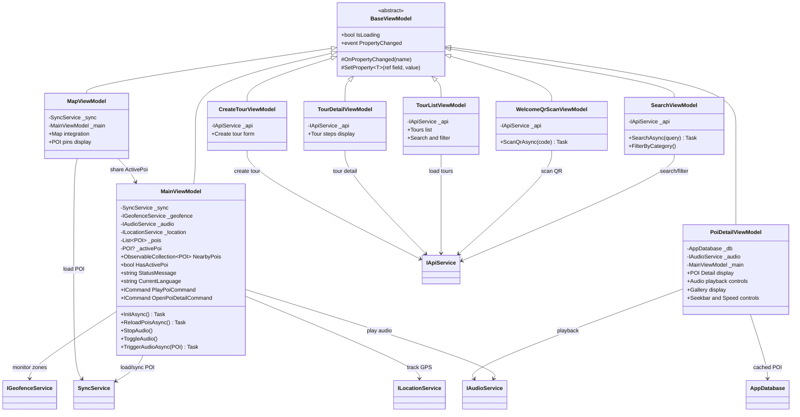
```mermaid
classDiagram
    direction TB

    class BaseViewModel {
        <<abstract>>
        +bool IsLoading
        +event PropertyChanged
        #OnPropertyChanged(name)
        #SetProperty~T~(ref field, value)
    }

    class MainViewModel {
        -SyncService _sync
        -IGeofenceService _geofence
        -IAudioService _audio
        -ILocationService _location
        -List~POI~ _pois
        -POI? _activePoi
        +ObservableCollection~POI~ NearbyPois
        +bool HasActivePoi
        +string StatusMessage
        +string CurrentLanguage
        +ICommand PlayPoiCommand
        +ICommand OpenPoiDetailCommand
        +InitAsync() Task
        +ReloadPoisAsync() Task
        +StopAudio()
        +ToggleAudio()
        +TriggerAudioAsync(POI) Task
    }

    class MapViewModel {
        -SyncService _sync
        -MainViewModel _main
        +Map integration
        +POI pins display
    }

    class SearchViewModel {
        -IApiService _api
        +SearchAsync(query) Task
        +FilterByCategory()
    }

    class PoiDetailViewModel {
        -AppDatabase _db
        -IAudioService _audio
        -MainViewModel _main
        +POI Detail display
        +Audio playback controls
        +Gallery display
        +Seekbar and Speed controls
    }

    class WelcomeQrScanViewModel {
        -IApiService _api
        +ScanQrAsync(code) Task
    }

    class TourListViewModel {
        -IApiService _api
        +Tours list
        +Search and filter
    }

    class TourDetailViewModel {
        -IApiService _api
        +Tour steps display
    }

    class CreateTourViewModel {
        -IApiService _api
        +Create tour form
    }

    BaseViewModel <|-- MainViewModel
    BaseViewModel <|-- MapViewModel
    BaseViewModel <|-- SearchViewModel
    BaseViewModel <|-- PoiDetailViewModel
    BaseViewModel <|-- WelcomeQrScanViewModel
    BaseViewModel <|-- TourListViewModel
    BaseViewModel <|-- TourDetailViewModel
    BaseViewModel <|-- CreateTourViewModel

    MainViewModel --> SyncService : load/sync POI
    MainViewModel --> IGeofenceService : monitor zones
    MainViewModel --> IAudioService : play audio
    MainViewModel --> ILocationService : track GPS
    MapViewModel --> SyncService : load POI
    MapViewModel --> MainViewModel : share ActivePoi
    SearchViewModel --> IApiService : search/filter
    PoiDetailViewModel --> IAudioService : playback
    PoiDetailViewModel --> AppDatabase : cached POI
    WelcomeQrScanViewModel --> IApiService : scan QR
    TourListViewModel --> IApiService : load tours
    TourDetailViewModel --> IApiService : tour detail
    CreateTourViewModel --> IApiService : create tour
```

### 10.9. Chi Tiết — Mobile Services & Data (`mobile/Services/`)

> Service interfaces, implementations, data layer và platform-specific components.

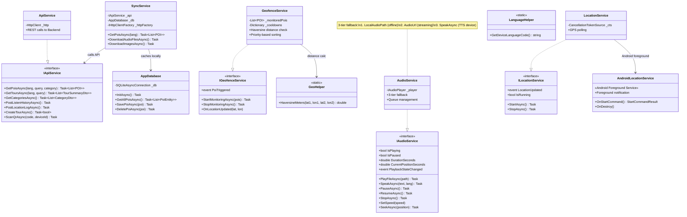
```mermaid
classDiagram
    direction TB

    class IApiService {
        <<interface>>
        +GetPoisAsync(lang, query, category) Task~List~POI~~
        +GetToursAsync(lang, query) Task~List~TourSummaryDto~~
        +GetCategoriesAsync() Task~List~CategoryDto~~
        +PostListenHistoryAsync() Task
        +PostLocationLogAsync() Task
        +CreateTourAsync() Task~bool~
        +ScanQrAsync(code, deviceId) Task
    }

    class IGeofenceService {
        <<interface>>
        +event PoiTriggered
        +StartMonitoringAsync(pois) Task
        +StopMonitoringAsync() Task
        +OnLocationUpdated(lat, lon)
    }

    class IAudioService {
        <<interface>>
        +bool IsPlaying
        +bool IsPaused
        +double DurationSeconds
        +double CurrentPositionSeconds
        +event PlaybackStateChanged
        +PlayFileAsync(path) Task
        +SpeakAsync(text, lang) Task
        +PauseAsync() Task
        +ResumeAsync() Task
        +StopAsync() Task
        +SetSpeed(speed)
        +SeekAsync(position) Task
    }

    class ILocationService {
        <<interface>>
        +event LocationUpdated
        +StartAsync() Task
        +StopAsync() Task
        +bool IsRunning
    }

    class ApiService {
        -HttpClient _http
        +REST calls to Backend
    }

    class GeofenceService {
        -List~POI~ _monitoredPois
        -Dictionary _cooldowns
        +Haversine distance check
        +Priority-based sorting
    }

    class AudioService {
        -IAudioPlayer _player
        +3-tier fallback
        +Queue management
    }

    class LocationService {
        -CancellationTokenSource _cts
        +GPS polling
    }

    class SyncService {
        -IApiService _api
        -AppDatabase _db
        -IHttpClientFactory _httpFactory
        +GetPoisAsync(lang) Task~List~POI~~
        +DownloadAudioFilesAsync() Task
        +DownloadImagesAsync() Task
    }

    class AppDatabase {
        -SQLiteAsyncConnection _db
        +InitAsync() Task
        +GetAllPoisAsync() Task~List~PoiEntity~~
        +SavePoiAsync(poi) Task
        +DeletePoiAsync(poi) Task
    }

    class GeoHelper {
        <<static>>
        +HaversineMeters(lat1, lon1, lat2, lon2) double
    }

    class LanguageHelper {
        <<static>>
        +GetDeviceLanguageCode() string
    }

    class AndroidLocationService {
        «Android Foreground Service»
        +OnStartCommand() StartCommandResult
        +OnDestroy()
        +Foreground notification
    }

    ApiService ..|> IApiService
    GeofenceService ..|> IGeofenceService
    AudioService ..|> IAudioService
    LocationService ..|> ILocationService

    SyncService --> IApiService : calls API
    SyncService --> AppDatabase : caches locally
    GeofenceService --> GeoHelper : distance calc
    LocationService --> AndroidLocationService : Android foreground

    note for AudioService "3-tier fallback:\n1. LocalAudioPath (offline)\n2. AudioUrl (streaming)\n3. SpeakAsync (TTS device)"
```

---

## 🔄 11. SƠ ĐỒ TRÌNH TỰ (SEQUENCE DIAGRAMS)

### 11.1. Khởi Động App & Đồng Bộ Dữ Liệu (📱 Mobile)

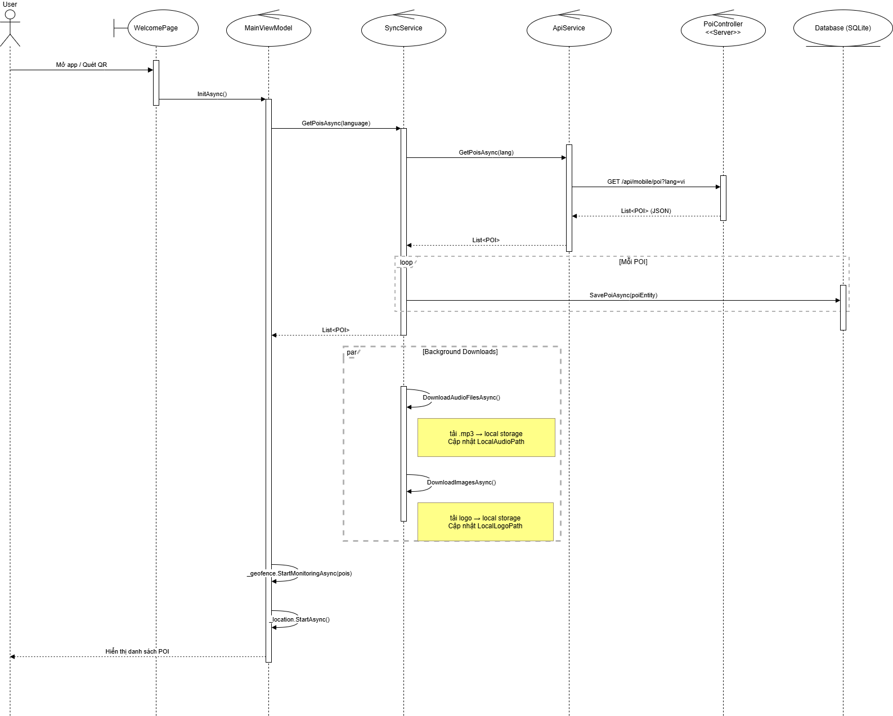

### 11.2. Theo Dõi Vị Trí & Tự Động Phát Audio (📱 Mobile)

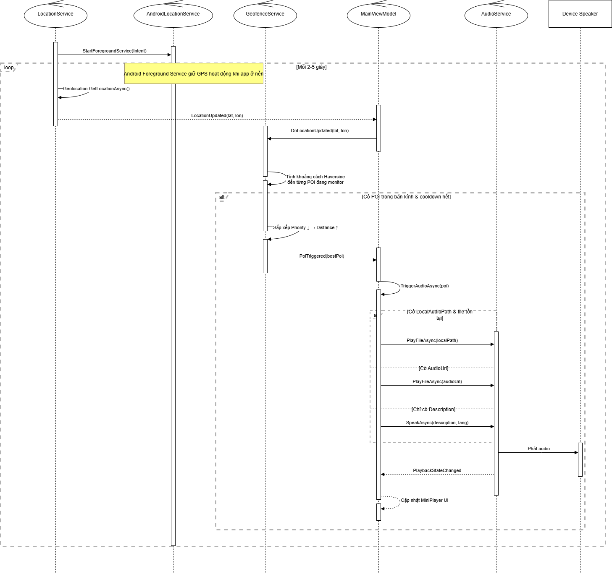

### 11.3. Content Pipeline — Backend (CMS + Auto-generate)

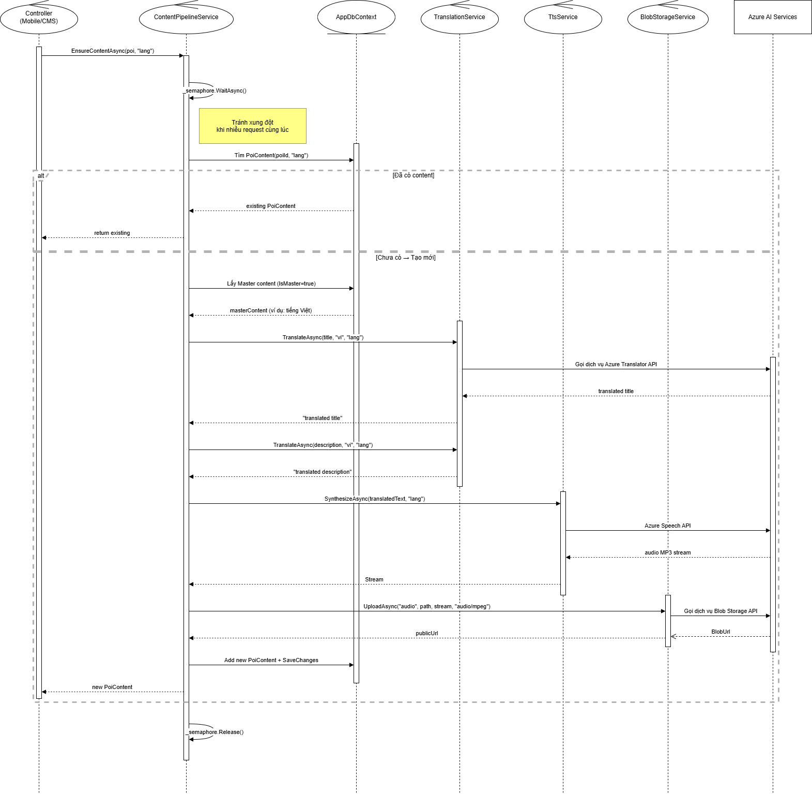

### 11.4. Xác Thực QR Code (📱 Mobile → Backend)

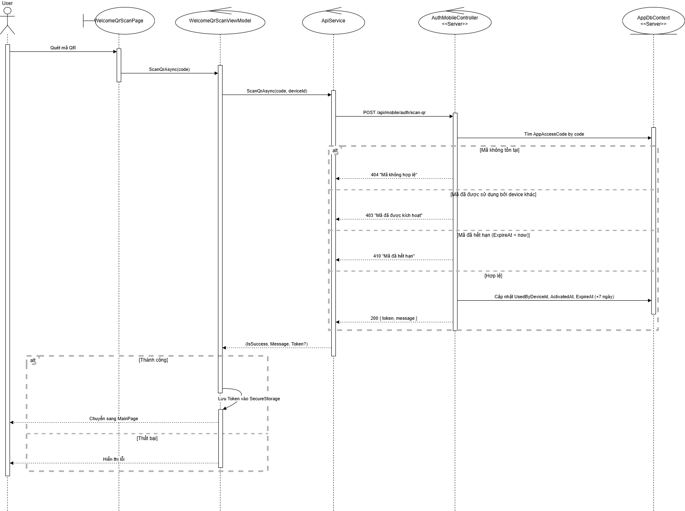

### 11.5. CMS — Đăng Nhập (🌐 Web CMS)

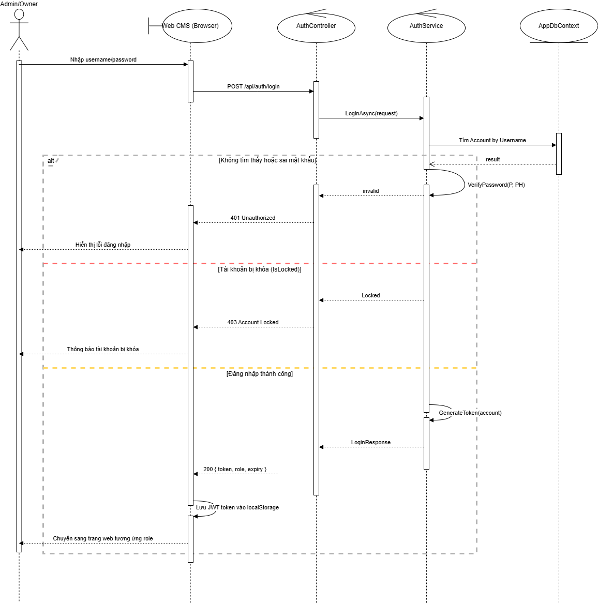

### 11.6. CMS — Quản Lý POI (🌐 Web CMS)

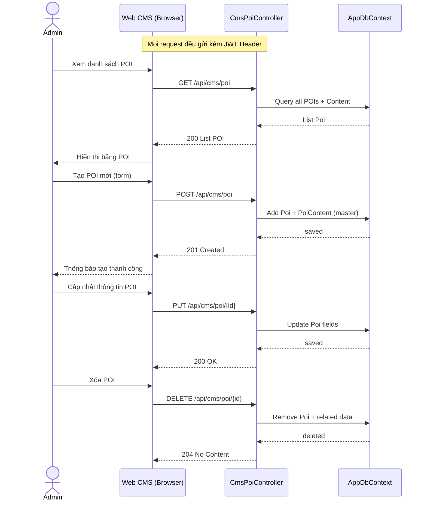
```mermaid
sequenceDiagram
    actor Admin
    participant CMS as Web CMS (Browser)
    participant PoiCtrl as CmsPoiController
    participant DB as AppDbContext

    Note over CMS,PoiCtrl: Mọi request đều gửi kèm JWT Header

    Admin ->> CMS: Xem danh sách POI
    CMS ->> PoiCtrl: GET /api/cms/poi
    PoiCtrl ->> DB: Query all POIs + Content
    DB -->> PoiCtrl: List Poi
    PoiCtrl -->> CMS: 200 List POI
    CMS -->> Admin: Hiển thị bảng POI

    Admin ->> CMS: Tạo POI mới (form)
    CMS ->> PoiCtrl: POST /api/cms/poi
    PoiCtrl ->> DB: Add Poi + PoiContent (master)
    DB -->> PoiCtrl: saved
    PoiCtrl -->> CMS: 201 Created
    CMS -->> Admin: Thông báo tạo thành công

    Admin ->> CMS: Cập nhật thông tin POI
    CMS ->> PoiCtrl: PUT /api/cms/poi/{id}
    PoiCtrl ->> DB: Update Poi fields
    DB -->> PoiCtrl: saved
    PoiCtrl -->> CMS: 200 OK

    Admin ->> CMS: Xóa POI
    CMS ->> PoiCtrl: DELETE /api/cms/poi/{id}
    PoiCtrl ->> DB: Remove Poi + related data
    DB -->> PoiCtrl: deleted
    PoiCtrl -->> CMS: 204 No Content
```

### 11.7. CMS — Content Pipeline Trigger (🌐 Web CMS)

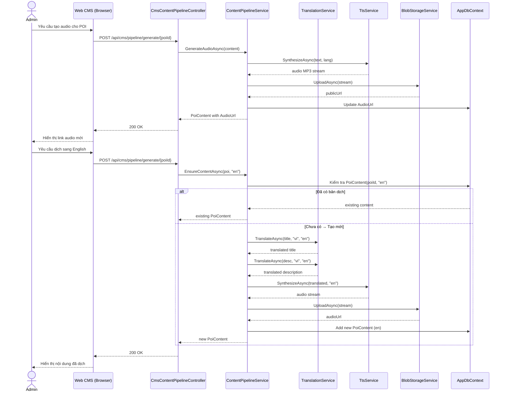
```mermaid
sequenceDiagram
    actor Admin
    participant CMS as Web CMS (Browser)
    participant PipeCtrl as CmsContentPipelineController
    participant Pipeline as ContentPipelineService
    participant Trans as TranslationService
    participant TTS as TtsService
    participant Blob as BlobStorageService
    participant DB as AppDbContext

    Admin ->> CMS: Yêu cầu tạo audio cho POI
    CMS ->> PipeCtrl: POST /api/cms/pipeline/generate/{poiId}
    PipeCtrl ->> Pipeline: GenerateAudioAsync(content)
    Pipeline ->> TTS: SynthesizeAsync(text, lang)
    TTS -->> Pipeline: audio MP3 stream
    Pipeline ->> Blob: UploadAsync(stream)
    Blob -->> Pipeline: publicUrl
    Pipeline ->> DB: Update AudioUrl
    Pipeline -->> PipeCtrl: PoiContent with AudioUrl
    PipeCtrl -->> CMS: 200 OK
    CMS -->> Admin: Hiển thị link audio mới

    Admin ->> CMS: Yêu cầu dịch sang English
    CMS ->> PipeCtrl: POST /api/cms/pipeline/generate/{poiId}
    PipeCtrl ->> Pipeline: EnsureContentAsync(poi, "en")
    Pipeline ->> DB: Kiểm tra PoiContent(poiId, "en")

    alt Đã có bản dịch
        DB -->> Pipeline: existing content
        Pipeline -->> PipeCtrl: existing PoiContent
    else Chưa có → Tạo mới
        Pipeline ->> Trans: TranslateAsync(title, "vi", "en")
        Trans -->> Pipeline: translated title
        Pipeline ->> Trans: TranslateAsync(desc, "vi", "en")
        Trans -->> Pipeline: translated description
        Pipeline ->> TTS: SynthesizeAsync(translated, "en")
        TTS -->> Pipeline: audio stream
        Pipeline ->> Blob: UploadAsync(stream)
        Blob -->> Pipeline: audioUrl
        Pipeline ->> DB: Add new PoiContent (en)
        Pipeline -->> PipeCtrl: new PoiContent
    end

    PipeCtrl -->> CMS: 200 OK
    CMS -->> Admin: Hiển thị nội dung đã dịch
```

### 11.8. CMS — Gallery & Media Upload (🌐 Web CMS)

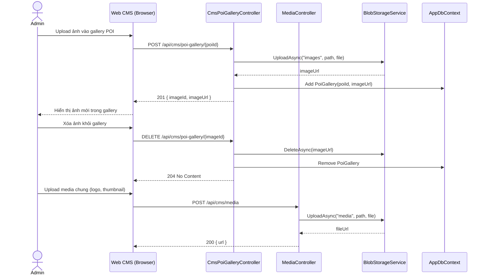
```mermaid
sequenceDiagram
    actor Admin
    participant CMS as Web CMS (Browser)
    participant GalleryCtrl as CmsPoiGalleryController
    participant MediaCtrl as MediaController
    participant Blob as BlobStorageService
    participant DB as AppDbContext

    Admin ->> CMS: Upload ảnh vào gallery POI
    CMS ->> GalleryCtrl: POST /api/cms/poi-gallery/{poiId}
    GalleryCtrl ->> Blob: UploadAsync("images", path, file)
    Blob -->> GalleryCtrl: imageUrl
    GalleryCtrl ->> DB: Add PoiGallery(poiId, imageUrl)
    GalleryCtrl -->> CMS: 201 { imageId, imageUrl }
    CMS -->> Admin: Hiển thị ảnh mới trong gallery

    Admin ->> CMS: Xóa ảnh khỏi gallery
    CMS ->> GalleryCtrl: DELETE /api/cms/poi-gallery/{imageId}
    GalleryCtrl ->> Blob: DeleteAsync(imageUrl)
    GalleryCtrl ->> DB: Remove PoiGallery
    GalleryCtrl -->> CMS: 204 No Content

    Admin ->> CMS: Upload media chung (logo, thumbnail)
    CMS ->> MediaCtrl: POST /api/cms/media
    MediaCtrl ->> Blob: UploadAsync("media", path, file)
    Blob -->> MediaCtrl: fileUrl
    MediaCtrl -->> CMS: 200 { url }
```

### 11.9. Phát Audio Mini-Player (📱 Mobile — Pause/Resume)

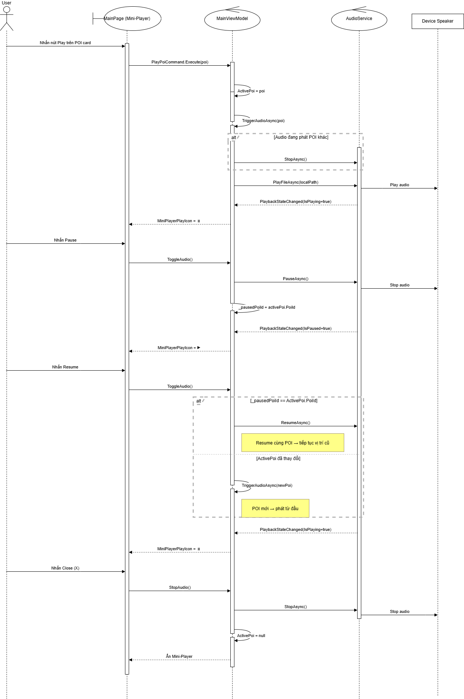

### 11.10. Tìm Kiếm & Lọc POI (📱 Mobile)

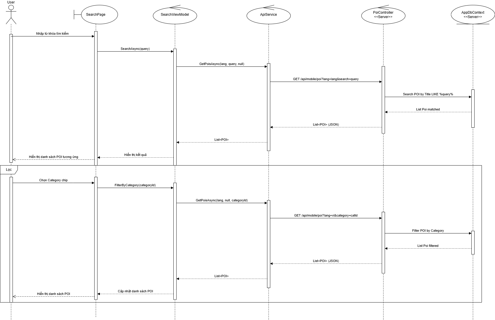

### 11.11. Xem Tour (📱 Mobile)

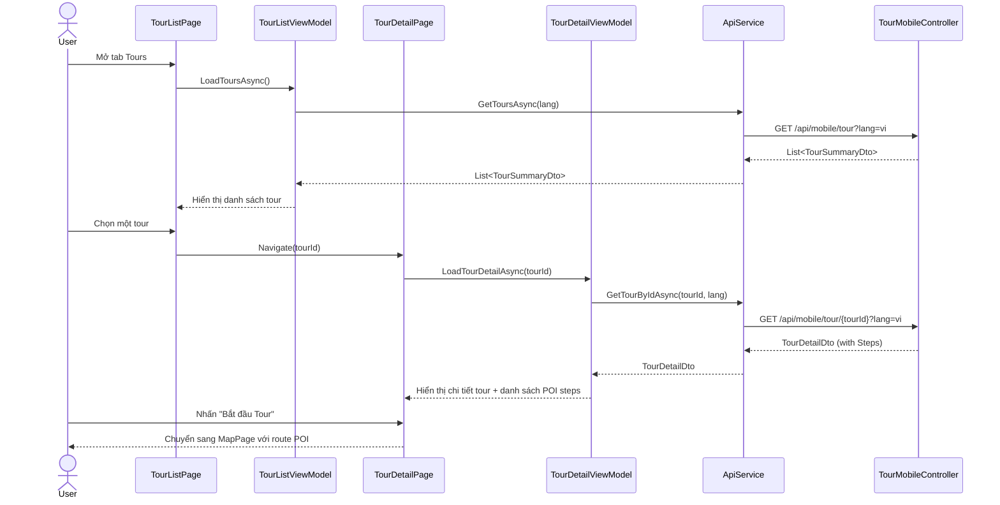
```mermaid
sequenceDiagram
    actor User
    participant ListUI as TourListPage
    participant ListVM as TourListViewModel
    participant DetailUI as TourDetailPage
    participant DetailVM as TourDetailViewModel
    participant API as ApiService
    participant Backend as TourMobileController

    User ->> ListUI: Mở tab Tours
    ListUI ->> ListVM: LoadToursAsync()
    ListVM ->> API: GetToursAsync(lang)
    API ->> Backend: GET /api/mobile/tour?lang=vi
    Backend -->> API: List<TourSummaryDto>
    API -->> ListVM: List<TourSummaryDto>
    ListVM -->> ListUI: Hiển thị danh sách tour

    User ->> ListUI: Chọn một tour
    ListUI ->> DetailUI: Navigate(tourId)
    DetailUI ->> DetailVM: LoadTourDetailAsync(tourId)
    DetailVM ->> API: GetTourByIdAsync(tourId, lang)
    API ->> Backend: GET /api/mobile/tour/{tourId}?lang=vi
    Backend -->> API: TourDetailDto (with Steps)
    API -->> DetailVM: TourDetailDto
    DetailVM -->> DetailUI: Hiển thị chi tiết tour + danh sách POI steps

    User ->> DetailUI: Nhấn "Bắt đầu Tour"
    DetailUI -->> User: Chuyển sang MapPage với route POI
```

### 11.12. CMS — Bulk Content Pipeline: GenerateAllLanguages (⚙️ Backend)

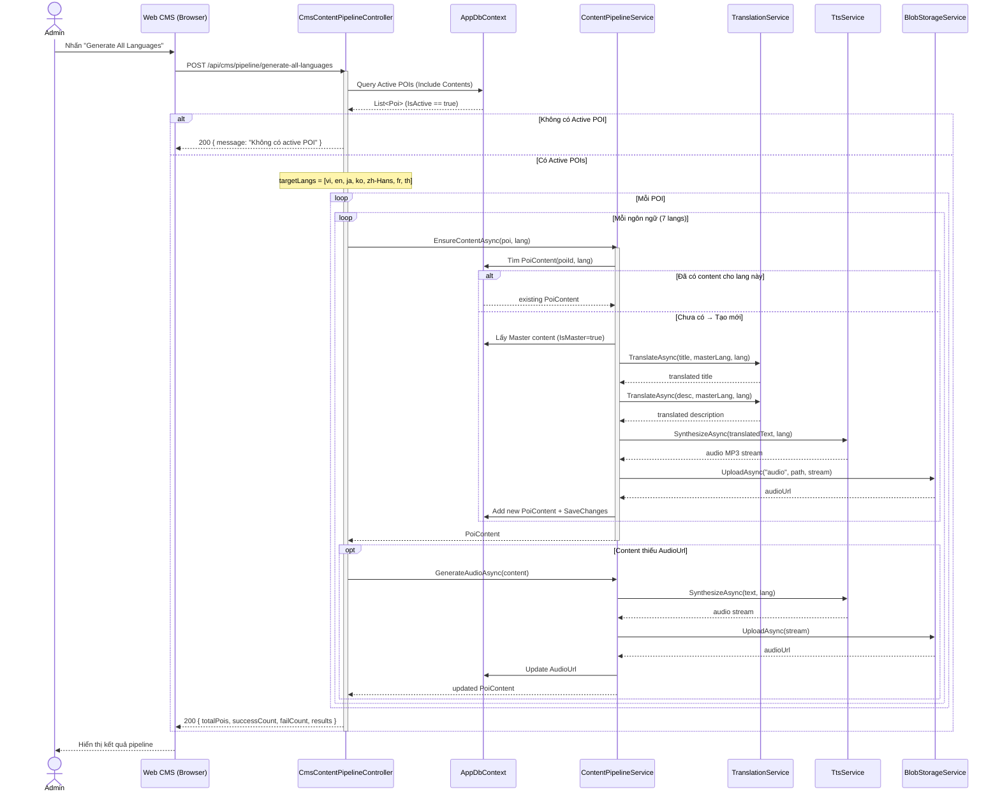
```mermaid
sequenceDiagram
    actor Admin
    participant CMS as Web CMS (Browser)
    participant PipeCtrl as CmsContentPipelineController
    participant DB as AppDbContext
    participant Pipeline as ContentPipelineService
    participant Trans as TranslationService
    participant TTS as TtsService
    participant Blob as BlobStorageService

    Admin ->> CMS: Nhấn "Generate All Languages"
    CMS ->> PipeCtrl: POST /api/cms/pipeline/generate-all-languages
    activate PipeCtrl

    PipeCtrl ->> DB: Query Active POIs (Include Contents)
    DB -->> PipeCtrl: List<Poi> (IsActive == true)

    alt Không có Active POI
        PipeCtrl -->> CMS: 200 { message: "Không có active POI" }
    else Có Active POIs
        Note over PipeCtrl: targetLangs = [vi, en, ja, ko, zh-Hans, fr, th]

        loop Mỗi POI
            loop Mỗi ngôn ngữ (7 langs)
                PipeCtrl ->> Pipeline: EnsureContentAsync(poi, lang)
                activate Pipeline

                Pipeline ->> DB: Tìm PoiContent(poiId, lang)

                alt Đã có content cho lang này
                    DB -->> Pipeline: existing PoiContent
                else Chưa có → Tạo mới
                    Pipeline ->> DB: Lấy Master content (IsMaster=true)
                    Pipeline ->> Trans: TranslateAsync(title, masterLang, lang)
                    Trans -->> Pipeline: translated title
                    Pipeline ->> Trans: TranslateAsync(desc, masterLang, lang)
                    Trans -->> Pipeline: translated description
                    Pipeline ->> TTS: SynthesizeAsync(translatedText, lang)
                    TTS -->> Pipeline: audio MP3 stream
                    Pipeline ->> Blob: UploadAsync("audio", path, stream)
                    Blob -->> Pipeline: audioUrl
                    Pipeline ->> DB: Add new PoiContent + SaveChanges
                end

                Pipeline -->> PipeCtrl: PoiContent
                deactivate Pipeline

                opt Content thiếu AudioUrl
                    PipeCtrl ->> Pipeline: GenerateAudioAsync(content)
                    Pipeline ->> TTS: SynthesizeAsync(text, lang)
                    TTS -->> Pipeline: audio stream
                    Pipeline ->> Blob: UploadAsync(stream)
                    Blob -->> Pipeline: audioUrl
                    Pipeline ->> DB: Update AudioUrl
                    Pipeline -->> PipeCtrl: updated PoiContent
                end
            end
        end

        PipeCtrl -->> CMS: 200 { totalPois, successCount, failCount, results }
    end

    deactivate PipeCtrl
    CMS -->> Admin: Hiển thị kết quả pipeline
```


### 11.13. CMS — Quản Lý Tài Khoản (🌐 Web CMS)

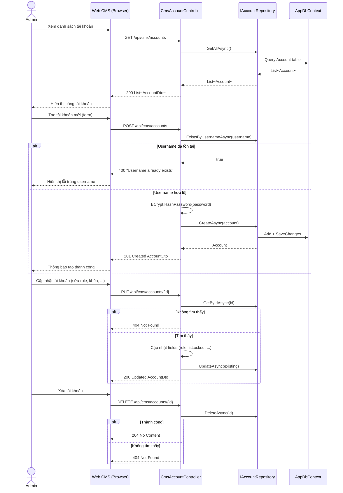
```mermaid
sequenceDiagram
    actor Admin
    participant CMS as Web CMS (Browser)
    participant AccCtrl as CmsAccountController
    participant Repo as IAccountRepository
    participant DB as AppDbContext

    Admin ->> CMS: Xem danh sách tài khoản
    CMS ->> AccCtrl: GET /api/cms/accounts
    AccCtrl ->> Repo: GetAllAsync()
    Repo ->> DB: Query Account table
    DB -->> Repo: List~Account~
    Repo -->> AccCtrl: List~Account~
    AccCtrl -->> CMS: 200 List~AccountDto~
    CMS -->> Admin: Hiển thị bảng tài khoản

    Admin ->> CMS: Tạo tài khoản mới (form)
    CMS ->> AccCtrl: POST /api/cms/accounts
    AccCtrl ->> Repo: ExistsByUsernameAsync(username)

    alt Username đã tồn tại
        Repo -->> AccCtrl: true
        AccCtrl -->> CMS: 400 "Username already exists"
        CMS -->> Admin: Hiển thị lỗi trùng username
    else Username hợp lệ
        AccCtrl ->> AccCtrl: BCrypt.HashPassword(password)
        AccCtrl ->> Repo: CreateAsync(account)
        Repo ->> DB: Add + SaveChanges
        Repo -->> AccCtrl: Account
        AccCtrl -->> CMS: 201 Created AccountDto
        CMS -->> Admin: Thông báo tạo thành công
    end

    Admin ->> CMS: Cập nhật tài khoản (sửa role, khóa, ...)
    CMS ->> AccCtrl: PUT /api/cms/accounts/{id}
    AccCtrl ->> Repo: GetByIdAsync(id)
    alt Không tìm thấy
        AccCtrl -->> CMS: 404 Not Found
    else Tìm thấy
        AccCtrl ->> AccCtrl: Cập nhật fields (role, isLocked, ...)
        AccCtrl ->> Repo: UpdateAsync(existing)
        AccCtrl -->> CMS: 200 Updated AccountDto
    end

    Admin ->> CMS: Xóa tài khoản
    CMS ->> AccCtrl: DELETE /api/cms/accounts/{id}
    AccCtrl ->> Repo: DeleteAsync(id)
    alt Thành công
        AccCtrl -->> CMS: 204 No Content
    else Không tìm thấy
        AccCtrl -->> CMS: 404 Not Found
    end
```

### 11.14. CMS — Quản Lý Danh Mục (🌐 Web CMS)

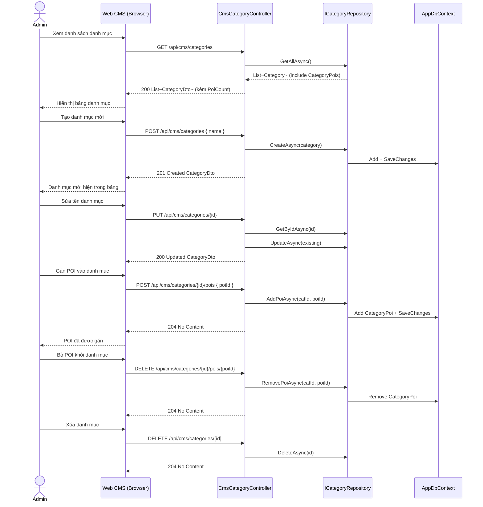
```mermaid
sequenceDiagram
    actor Admin
    participant CMS as Web CMS (Browser)
    participant CatCtrl as CmsCategoryController
    participant Repo as ICategoryRepository
    participant DB as AppDbContext

    Admin ->> CMS: Xem danh sách danh mục
    CMS ->> CatCtrl: GET /api/cms/categories
    CatCtrl ->> Repo: GetAllAsync()
    Repo -->> CatCtrl: List~Category~ (include CategoryPois)
    CatCtrl -->> CMS: 200 List~CategoryDto~ (kèm PoiCount)
    CMS -->> Admin: Hiển thị bảng danh mục

    Admin ->> CMS: Tạo danh mục mới
    CMS ->> CatCtrl: POST /api/cms/categories { name }
    CatCtrl ->> Repo: CreateAsync(category)
    Repo ->> DB: Add + SaveChanges
    CatCtrl -->> CMS: 201 Created CategoryDto
    CMS -->> Admin: Danh mục mới hiện trong bảng

    Admin ->> CMS: Sửa tên danh mục
    CMS ->> CatCtrl: PUT /api/cms/categories/{id}
    CatCtrl ->> Repo: GetByIdAsync(id)
    CatCtrl ->> Repo: UpdateAsync(existing)
    CatCtrl -->> CMS: 200 Updated CategoryDto

    Admin ->> CMS: Gán POI vào danh mục
    CMS ->> CatCtrl: POST /api/cms/categories/{id}/pois { poiId }
    CatCtrl ->> Repo: AddPoiAsync(catId, poiId)
    Repo ->> DB: Add CategoryPoi + SaveChanges
    CatCtrl -->> CMS: 204 No Content
    CMS -->> Admin: POI đã được gán

    Admin ->> CMS: Bỏ POI khỏi danh mục
    CMS ->> CatCtrl: DELETE /api/cms/categories/{id}/pois/{poiId}
    CatCtrl ->> Repo: RemovePoiAsync(catId, poiId)
    Repo ->> DB: Remove CategoryPoi
    CatCtrl -->> CMS: 204 No Content

    Admin ->> CMS: Xóa danh mục
    CMS ->> CatCtrl: DELETE /api/cms/categories/{id}
    CatCtrl ->> Repo: DeleteAsync(id)
    CatCtrl -->> CMS: 204 No Content
```

### 11.15. CMS — Quản Lý Tour (🌐 Web CMS)

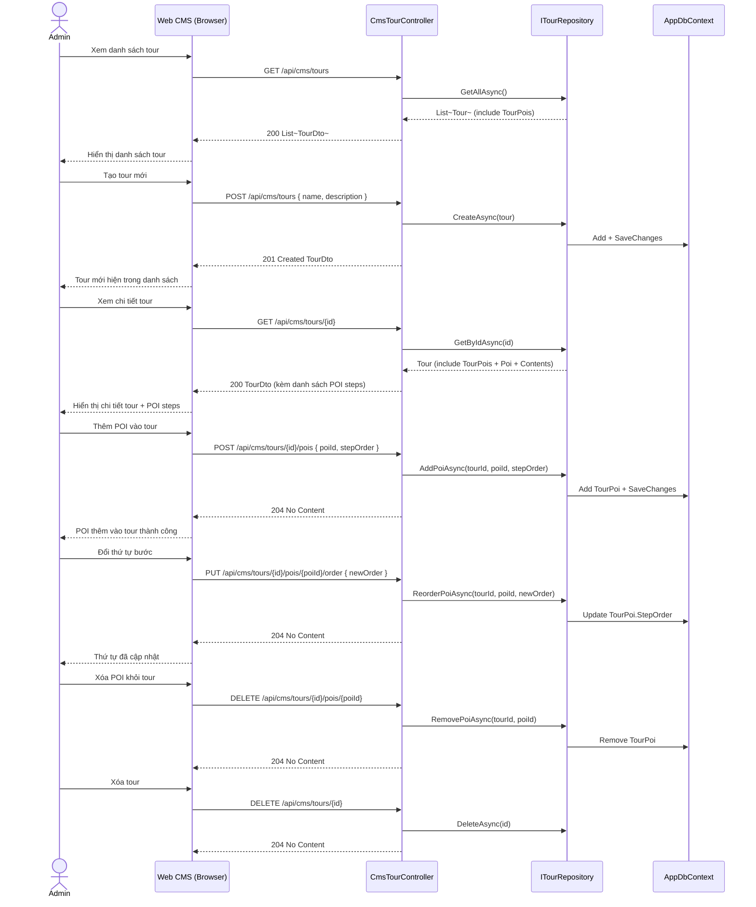
```mermaid
sequenceDiagram
    actor Admin
    participant CMS as Web CMS (Browser)
    participant TourCtrl as CmsTourController
    participant Repo as ITourRepository
    participant DB as AppDbContext

    Admin ->> CMS: Xem danh sách tour
    CMS ->> TourCtrl: GET /api/cms/tours
    TourCtrl ->> Repo: GetAllAsync()
    Repo -->> TourCtrl: List~Tour~ (include TourPois)
    TourCtrl -->> CMS: 200 List~TourDto~
    CMS -->> Admin: Hiển thị danh sách tour

    Admin ->> CMS: Tạo tour mới
    CMS ->> TourCtrl: POST /api/cms/tours { name, description }
    TourCtrl ->> Repo: CreateAsync(tour)
    Repo ->> DB: Add + SaveChanges
    TourCtrl -->> CMS: 201 Created TourDto
    CMS -->> Admin: Tour mới hiện trong danh sách

    Admin ->> CMS: Xem chi tiết tour
    CMS ->> TourCtrl: GET /api/cms/tours/{id}
    TourCtrl ->> Repo: GetByIdAsync(id)
    Repo -->> TourCtrl: Tour (include TourPois + Poi + Contents)
    TourCtrl -->> CMS: 200 TourDto (kèm danh sách POI steps)
    CMS -->> Admin: Hiển thị chi tiết tour + POI steps

    Admin ->> CMS: Thêm POI vào tour
    CMS ->> TourCtrl: POST /api/cms/tours/{id}/pois { poiId, stepOrder }
    TourCtrl ->> Repo: AddPoiAsync(tourId, poiId, stepOrder)
    Repo ->> DB: Add TourPoi + SaveChanges
    TourCtrl -->> CMS: 204 No Content
    CMS -->> Admin: POI thêm vào tour thành công

    Admin ->> CMS: Đổi thứ tự bước
    CMS ->> TourCtrl: PUT /api/cms/tours/{id}/pois/{poiId}/order { newOrder }
    TourCtrl ->> Repo: ReorderPoiAsync(tourId, poiId, newOrder)
    Repo ->> DB: Update TourPoi.StepOrder
    TourCtrl -->> CMS: 204 No Content
    CMS -->> Admin: Thứ tự đã cập nhật

    Admin ->> CMS: Xóa POI khỏi tour
    CMS ->> TourCtrl: DELETE /api/cms/tours/{id}/pois/{poiId}
    TourCtrl ->> Repo: RemovePoiAsync(tourId, poiId)
    Repo ->> DB: Remove TourPoi
    TourCtrl -->> CMS: 204 No Content

    Admin ->> CMS: Xóa tour
    CMS ->> TourCtrl: DELETE /api/cms/tours/{id}
    TourCtrl ->> Repo: DeleteAsync(id)
    TourCtrl -->> CMS: 204 No Content
```


---

## 📋 12. SƠ ĐỒ HOẠT ĐỘNG (ACTIVITY DIAGRAMS)

> **Quy ước ký hiệu:** `((●))` = Start (filled circle) · `((◉))` = End · `{ }` = Decision (diamond) · `[ ]` = Action (rectangle)

### 12.1. Luồng Khởi Động App & Quyết Định Màn Hình (📱 Mobile)

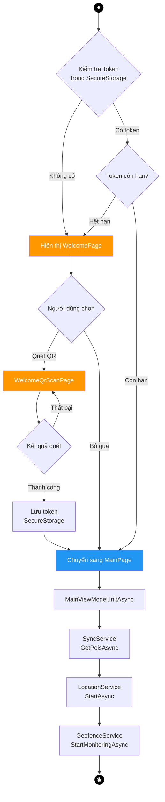
```mermaid
flowchart TD
    START(( ● )) --> CHECK_TOKEN{Kiểm tra Token<br/>trong SecureStorage}
    
    CHECK_TOKEN -- Không có --> WELCOME[Hiển thị WelcomePage]
    CHECK_TOKEN -- Có token --> VALIDATE{Token còn hạn?}
    
    VALIDATE -- Hết hạn --> WELCOME
    VALIDATE -- Còn hạn --> MAIN[Chuyển sang MainPage]
    
    WELCOME --> QR_OPTION{Người dùng chọn}
    QR_OPTION -- Quét QR --> QR_SCAN[WelcomeQrScanPage]
    QR_OPTION -- Bỏ qua --> MAIN

    QR_SCAN --> SCAN_RESULT{Kết quả quét}
    SCAN_RESULT -- Thành công --> SAVE_TOKEN[Lưu token<br/>SecureStorage]
    SAVE_TOKEN --> MAIN
    SCAN_RESULT -- Thất bại --> QR_SCAN

    MAIN --> INIT[MainViewModel.InitAsync]
    INIT --> SYNC[SyncService<br/>GetPoisAsync]
    SYNC --> START_GPS[LocationService<br/>StartAsync]
    START_GPS --> START_GEO[GeofenceService<br/>StartMonitoringAsync]
    START_GEO --> END_NODE(( ◉ ))

    style START fill:#000,color:#fff,stroke:#000
    style END_NODE fill:#000,color:#fff,stroke:#fff,stroke-width:3px
    style WELCOME fill:#FF9800,color:#fff
    style QR_SCAN fill:#FF9800,color:#fff
    style MAIN fill:#2196F3,color:#fff
```

### 12.2. Luồng Xử Lý Geofence — Kích Hoạt POI Tự Động (📱 Mobile)

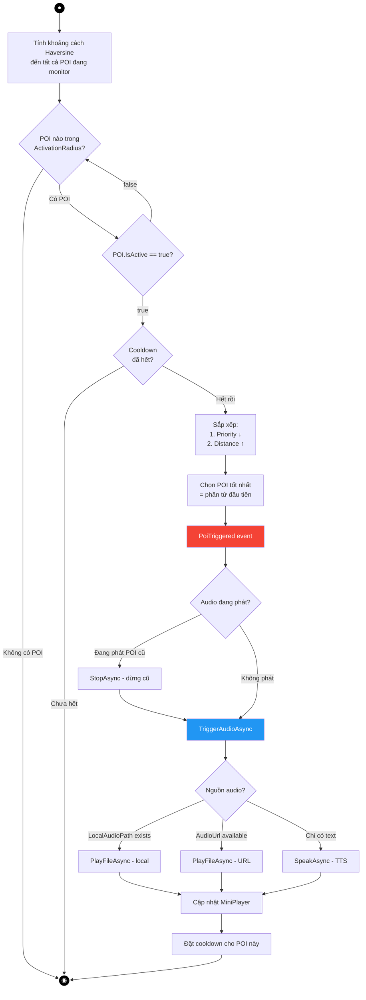
```mermaid
flowchart TD
    START(( ● )) --> CALC[Tính khoảng cách Haversine<br/>đến tất cả POI đang monitor]
    
    CALC --> FILTER{POI nào trong<br/>ActivationRadius?}
    
    FILTER -- Không có POI --> END_WAIT(( ◉ ))
    FILTER -- Có POI --> CHECK_ACTIVE{POI.IsActive == true?}
    
    CHECK_ACTIVE -- false --> FILTER
    CHECK_ACTIVE -- true --> CHECK_COOLDOWN{Cooldown<br/>đã hết?}
    
    CHECK_COOLDOWN -- Chưa hết --> END_WAIT
    CHECK_COOLDOWN -- Hết rồi --> SORT[Sắp xếp:<br/>1. Priority ↓<br/>2. Distance ↑]
    
    SORT --> SELECT[Chọn POI tốt nhất<br/>= phần tử đầu tiên]
    
    SELECT --> TRIGGER[PoiTriggered event]
    
    TRIGGER --> AUDIO_CHECK{Audio đang phát?}
    
    AUDIO_CHECK -- Đang phát POI cũ --> STOP_OLD[StopAsync - dừng cũ]
    STOP_OLD --> PLAY_NEW
    AUDIO_CHECK -- Không phát --> PLAY_NEW
    
    PLAY_NEW[TriggerAudioAsync] --> FALLBACK{Nguồn audio?}
    
    FALLBACK -- LocalAudioPath exists --> PLAY_LOCAL[PlayFileAsync - local]
    FALLBACK -- AudioUrl available --> PLAY_URL[PlayFileAsync - URL]
    FALLBACK -- Chỉ có text --> PLAY_TTS[SpeakAsync - TTS]
    
    PLAY_LOCAL --> UPDATE_UI[Cập nhật MiniPlayer]
    PLAY_URL --> UPDATE_UI
    PLAY_TTS --> UPDATE_UI
    UPDATE_UI --> SET_COOLDOWN[Đặt cooldown cho POI này]
    SET_COOLDOWN --> END_WAIT

    style START fill:#000,color:#fff,stroke:#000
    style END_WAIT fill:#000,color:#fff,stroke:#fff,stroke-width:3px
    style TRIGGER fill:#F44336,color:#fff
    style PLAY_NEW fill:#2196F3,color:#fff
```

### 12.3. Luồng Content Pipeline — Backend

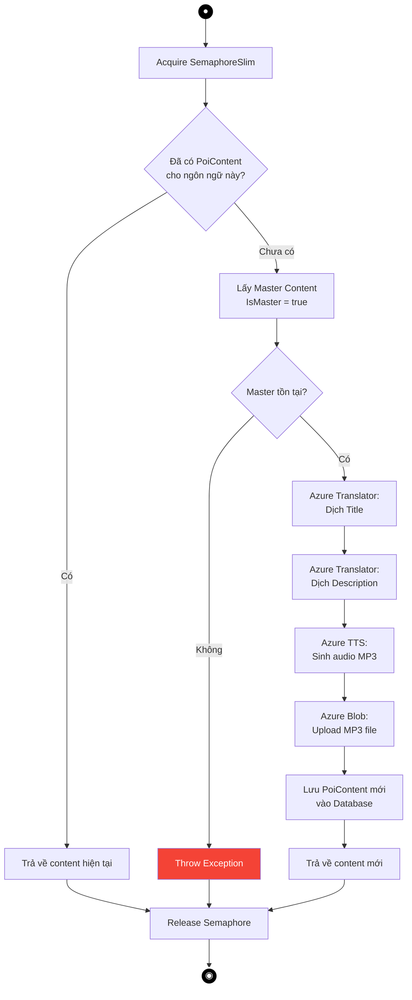
```mermaid
flowchart TD
    START(( ● )) --> LOCK[Acquire SemaphoreSlim]
    
    LOCK --> CHECK_EXISTING{Đã có PoiContent<br/>cho ngôn ngữ này?}
    
    CHECK_EXISTING -- Có --> RETURN_EXISTING[Trả về content hiện tại]
    RETURN_EXISTING --> RELEASE[Release Semaphore]
    
    CHECK_EXISTING -- Chưa có --> GET_MASTER[Lấy Master Content<br/>IsMaster = true]
    
    GET_MASTER --> MASTER_EXISTS{Master tồn tại?}
    
    MASTER_EXISTS -- Không --> ERROR[Throw Exception]
    ERROR --> RELEASE
    
    MASTER_EXISTS -- Có --> TRANSLATE_TITLE[Azure Translator:<br/>Dịch Title]
    TRANSLATE_TITLE --> TRANSLATE_DESC[Azure Translator:<br/>Dịch Description]
    TRANSLATE_DESC --> TTS_GEN[Azure TTS:<br/>Sinh audio MP3]
    TTS_GEN --> UPLOAD_BLOB[Azure Blob:<br/>Upload MP3 file]
    UPLOAD_BLOB --> SAVE_DB[Lưu PoiContent mới<br/>vào Database]
    SAVE_DB --> RETURN_NEW[Trả về content mới]
    RETURN_NEW --> RELEASE
    
    RELEASE --> END_NODE(( ◉ ))

    style START fill:#000,color:#fff,stroke:#000
    style END_NODE fill:#000,color:#fff,stroke:#fff,stroke-width:3px
    style ERROR fill:#F44336,color:#fff
```

### 12.4. Luồng Đồng Bộ Offline-First (📱 Mobile)

```mermaid
flowchart TD
    START(( ● )) --> TRY_API{Gọi API<br/>thành công?}
    
    TRY_API -- Thành công --> SAVE_CACHE[Lưu vào SQLite Cache]
    SAVE_CACHE --> BG_DOWNLOAD

    TRY_API -- Thất bại offline --> LOAD_CACHE[Đọc từ SQLite Cache]
    LOAD_CACHE --> RETURN[Trả về List POI]

    BG_DOWNLOAD[Background Download] --> DL_AUDIO[Tải audio .mp3<br/>→ local storage]
    DL_AUDIO --> DL_IMAGE[Tải logo/ảnh<br/>→ local storage]
    DL_IMAGE --> UPDATE_LOCAL[Cập nhật LocalAudioPath<br/>LocalLogoPath trong SQLite]
    UPDATE_LOCAL --> RETURN

    RETURN --> END_NODE(( ◉ ))

    style START fill:#000,color:#fff,stroke:#000
    style END_NODE fill:#000,color:#fff,stroke:#fff,stroke-width:3px
    style BG_DOWNLOAD fill:#FF9800,color:#fff
```

### 12.5. Xác Thực QR Code (📱 Mobile)

```mermaid
flowchart TD
    START(( ● )) --> DECODE[Giải mã QR → code string]
    DECODE --> SEND[POST /api/mobile/auth/scan-qr<br/>body: code + deviceId]
    
    SEND --> LOOKUP{Backend tìm<br/>AppAccessCode?}
    
    LOOKUP -- Không tìm thấy --> ERR_404[❌ Mã không hợp lệ]
    ERR_404 --> SHOW_ERR[Hiển thị lỗi cho user]
    
    LOOKUP -- Tìm thấy --> CHECK_DEVICE{UsedByDeviceId?}
    
    CHECK_DEVICE -- Đã dùng bởi<br/>device khác --> ERR_403[❌ Mã đã kích hoạt<br/>cho thiết bị khác]
    ERR_403 --> SHOW_ERR
    
    CHECK_DEVICE -- null hoặc<br/>cùng device --> CHECK_EXPIRE{ExpireAt nhỏ hơn now?}
    
    CHECK_EXPIRE -- Hết hạn --> ERR_410[❌ Mã đã hết hạn<br/>7 ngày]
    ERR_410 --> SHOW_ERR
    
    CHECK_EXPIRE -- Còn hạn<br/>hoặc lần đầu --> ACTIVATE[Kích hoạt mã:<br/>UsedByDeviceId = deviceId<br/>ActivatedAt = now<br/>ExpireAt = now + 7 days]
    
    ACTIVATE --> GEN_TOKEN[Sinh JWT token]
    GEN_TOKEN --> RETURN_OK[200 OK + token]
    RETURN_OK --> SAVE[Mobile lưu token<br/>vào SecureStorage]
    SAVE --> NAV[Chuyển sang MainPage]
    NAV --> END_SUCCESS(( ◉ ))
    
    SHOW_ERR --> RETRY{Thử lại?}
    RETRY -- Có --> DECODE
    RETRY -- Không --> END_FAIL(( ◉ ))

    style START fill:#000,color:#fff,stroke:#000
    style END_SUCCESS fill:#000,color:#fff,stroke:#fff,stroke-width:3px
    style END_FAIL fill:#000,color:#fff,stroke:#fff,stroke-width:3px
    style ERR_404 fill:#F44336,color:#fff
    style ERR_403 fill:#F44336,color:#fff
    style ERR_410 fill:#F44336,color:#fff
```

### 12.6. CMS — Quản Lý POI Activity (🌐 Web CMS)

```mermaid
flowchart TD
    START(( ● )) --> LOGIN{Admin đã<br/>đăng nhập?}
    
    LOGIN -- Chưa --> AUTH[Nhập username/password]
    AUTH --> VERIFY{Xác thực?}
    VERIFY -- Thất bại --> AUTH
    VERIFY -- Thành công --> SAVE_JWT[Lưu JWT token]
    SAVE_JWT --> DASHBOARD
    LOGIN -- Rồi --> DASHBOARD[Vào Dashboard CMS]
    
    DASHBOARD --> ACTION{Admin chọn<br/>hành động}
    
    ACTION -- Tạo POI --> CREATE_FORM[Điền form thông tin POI]
    CREATE_FORM --> VALIDATE_CREATE{Dữ liệu hợp lệ?}
    VALIDATE_CREATE -- Không --> CREATE_FORM
    VALIDATE_CREATE -- Có --> SAVE_POI[POST /api/cms/poi]
    SAVE_POI --> RESULT_CREATE{Thành công?}
    RESULT_CREATE -- Có --> DASHBOARD
    RESULT_CREATE -- Không --> SHOW_ERR[Hiển thị lỗi]
    SHOW_ERR --> DASHBOARD
    
    ACTION -- Sửa POI --> EDIT_FORM[Chỉnh sửa thông tin POI]
    EDIT_FORM --> SAVE_EDIT[PUT /api/cms/poi/id]
    SAVE_EDIT --> DASHBOARD
    
    ACTION -- Xóa POI --> CONFIRM{Xác nhận xóa?}
    CONFIRM -- Không --> DASHBOARD
    CONFIRM -- Có --> DELETE_POI[DELETE /api/cms/poi/id]
    DELETE_POI --> DASHBOARD
    
    ACTION -- Tạo Audio --> GEN_AUDIO[POST pipeline/generate/poiId]
    GEN_AUDIO --> DASHBOARD
    
    ACTION -- Dịch thuật --> GEN_TRANSLATE[POST pipeline/generate-all-languages]
    GEN_TRANSLATE --> DASHBOARD
    
    ACTION -- Đăng xuất --> END_NODE(( ◉ ))

    style START fill:#000,color:#fff,stroke:#000
    style END_NODE fill:#000,color:#fff,stroke:#fff,stroke-width:3px
    style DASHBOARD fill:#2196F3,color:#fff
    style SHOW_ERR fill:#F44336,color:#fff
```

### 12.7. CMS — Bulk Content Pipeline: GenerateAllLanguages (⚙️ Backend)

```mermaid
flowchart TD
    START((●)) --> CHECK_POIS[Query Active POIs from DB]
    CHECK_POIS --> HAS_POIS{Có Active POI?}

    HAS_POIS -- Không --> RETURN_EMPTY[Return: Không có active POI] --> END_EMPTY((◉))
    HAS_POIS -- Có --> INIT_LOOP[targetLangs = vi en ja ko zh-Hans fr th]

    INIT_LOOP --> LOOP_POI{Còn POI chưa xử lý?}
    LOOP_POI -- Không --> RETURN_RESULT[Return: totalPois, successCount, failCount] --> END_OK((◉))
    LOOP_POI -- Có --> NEXT_POI[Lấy POI tiếp theo]

    NEXT_POI --> LOOP_LANG{Còn lang chưa xử lý?}
    LOOP_LANG -- Không --> LOOP_POI
    LOOP_LANG -- Có --> NEXT_LANG[Lấy ngôn ngữ tiếp theo]

    NEXT_LANG --> ENSURE[EnsureContentAsync poi lang]
    ENSURE --> HAS_CONTENT{Đã có PoiContent?}

    HAS_CONTENT -- Có --> CHECK_AUDIO{Có AudioUrl?}
    HAS_CONTENT -- Không --> GET_MASTER[Lấy Master Content]
    GET_MASTER --> TRANSLATE_TITLE[TranslateAsync title]
    TRANSLATE_TITLE --> TRANSLATE_DESC[TranslateAsync description]
    TRANSLATE_DESC --> TTS_NEW[SynthesizeAsync text lang]
    TTS_NEW --> UPLOAD_NEW[UploadAsync to Blob Storage]
    UPLOAD_NEW --> SAVE_NEW[Add new PoiContent + SaveChanges]
    SAVE_NEW --> COUNT_SUCCESS_NEW[successCount++]
    COUNT_SUCCESS_NEW --> LOOP_LANG

    CHECK_AUDIO -- Có --> COUNT_SKIP[successCount++ skip TTS]
    COUNT_SKIP --> LOOP_LANG
    CHECK_AUDIO -- Không --> GEN_AUDIO[GenerateAudioAsync content]
    GEN_AUDIO --> TTS_EXIST[SynthesizeAsync text lang]
    TTS_EXIST --> UPLOAD_EXIST[UploadAsync to Blob]
    UPLOAD_EXIST --> UPDATE_URL[Update AudioUrl in DB]
    UPDATE_URL --> GEN_OK{Thành công?}
    GEN_OK -- Có --> COUNT_SUCCESS_GEN[successCount++]
    GEN_OK -- Không --> COUNT_FAIL[failCount++ + log error]
    COUNT_SUCCESS_GEN --> LOOP_LANG
    COUNT_FAIL --> LOOP_LANG

    style START fill:#000,color:#fff,stroke:#000
    style END_EMPTY fill:#000,color:#fff,stroke:#fff,stroke-width:3px
    style END_OK fill:#000,color:#fff,stroke:#fff,stroke-width:3px
    style RETURN_EMPTY fill:#FF9800,color:#fff
    style RETURN_RESULT fill:#4CAF50,color:#fff
    style COUNT_FAIL fill:#F44336,color:#fff
```

### 12.8. CMS — Quản Lý Tour Activity (🌐 Web CMS)

```mermaid
flowchart TD
    START((●)) --> LOGIN{Admin đã đăng nhập?}
    LOGIN -- Chưa --> AUTH[Đăng nhập CMS]
    AUTH --> LOGIN
    LOGIN -- Rồi --> VIEW_TOURS[GET /api/cms/tours]

    VIEW_TOURS --> HAS_TOURS{Có tour nào?}
    HAS_TOURS -- Không --> CREATE_TOUR[Tạo tour mới:<br/>POST /api/cms/tours]
    CREATE_TOUR --> SELECT_TOUR

    HAS_TOURS -- Có --> SELECT_TOUR[Chọn tour để quản lý]
    SELECT_TOUR --> ACTION{Admin chọn hành động}

    ACTION -- Thêm POI --> ADD_POI[POST /tours/id/pois<br/>poiId + stepOrder]
    ADD_POI --> REFRESH[Refresh chi tiết tour]

    ACTION -- Sắp xếp thứ tự --> REORDER[PUT /tours/id/pois/poiId/order<br/>newOrder]
    REORDER --> REFRESH

    ACTION -- Xóa POI --> REMOVE_POI[DELETE /tours/id/pois/poiId]
    REMOVE_POI --> REFRESH

    ACTION -- Sửa thông tin --> EDIT_TOUR[PUT /api/cms/tours/id<br/>name, description]
    EDIT_TOUR --> REFRESH

    ACTION -- Xóa tour --> CONFIRM{Xác nhận xóa?}
    CONFIRM -- Không --> REFRESH
    CONFIRM -- Có --> DELETE_TOUR[DELETE /api/cms/tours/id]
    DELETE_TOUR --> VIEW_TOURS

    REFRESH --> ACTION

    ACTION -- Quay lại --> VIEW_TOURS
    ACTION -- Đăng xuất --> END_NODE((◉))

    style START fill:#000,color:#fff,stroke:#000
    style END_NODE fill:#000,color:#fff,stroke:#fff,stroke-width:3px
    style CREATE_TOUR fill:#4CAF50,color:#fff
    style DELETE_TOUR fill:#F44336,color:#fff
    style ADD_POI fill:#2196F3,color:#fff
    style REORDER fill:#FF9800,color:#fff
```

### 12.9. CMS — Lựa Chọn Content Pipeline (⚙️ Backend)

> Admin chọn cấp độ Pipeline phù hợp dựa trên nhu cầu: Single → Batch → Bulk.

```mermaid
flowchart TD
    START((●)) --> NEED{Admin cần gì?}

    NEED -- "Audio cho 1 POI" --> SINGLE_INPUT[Chọn POI cụ thể]
    SINGLE_INPUT --> SINGLE[POST /pipeline/generate/poiId]
    SINGLE --> SINGLE_CHK{POI có content?}
    SINGLE_CHK -- Không --> SINGLE_ERR[Lỗi: Chưa có content]
    SINGLE_CHK -- Có --> SINGLE_TTS[TTS cho từng content<br/>thiếu AudioUrl]
    SINGLE_TTS --> SINGLE_OK[Trả về: danh sách content<br/>với AudioUrl mới]

    NEED -- "Audio cho tất cả<br/>content thiếu audio" --> BATCH[POST /pipeline/generate-all]
    BATCH --> BATCH_QUERY[Query tất cả PoiContent<br/>có AudioUrl = null<br/>thuộc Active POI]
    BATCH_QUERY --> BATCH_LOOP[Loop: TTS cho từng content]
    BATCH_LOOP --> BATCH_OK[Trả về: successCount<br/>failCount]

    NEED -- "Dịch + TTS đầy đủ<br/>7 ngôn ngữ" --> BULK[POST /pipeline/generate-all-languages]
    BULK --> BULK_QUERY[Query Active POIs]
    BULK_QUERY --> BULK_HAS{Có Active POI?}
    BULK_HAS -- Không --> BULK_EMPTY[Return: Không có active POI]
    BULK_HAS -- Có --> BULK_LOOP[Loop: mỗi POI × 7 langs<br/>vi en ja ko zh-Hans fr th]
    BULK_LOOP --> ENSURE[EnsureContentAsync]
    ENSURE --> ENSURE_CHK{Đã có content<br/>cho lang này?}
    ENSURE_CHK -- Chưa có --> TRANSLATE[Dịch từ Master<br/>Azure Translator]
    TRANSLATE --> GEN_TTS[TTS → MP3<br/>Azure Speech]
    GEN_TTS --> UPLOAD[Upload → Azure Blob]
    UPLOAD --> SAVE_DB[Lưu PoiContent mới]
    ENSURE_CHK -- Có nhưng<br/>thiếu audio --> GEN_TTS
    ENSURE_CHK -- Đầy đủ --> SKIP[Bỏ qua]
    SAVE_DB --> NEXT_LANG[Ngôn ngữ tiếp theo]
    SKIP --> NEXT_LANG
    NEXT_LANG --> BULK_LOOP
    BULK_LOOP --> BULK_OK[Trả về: totalPois<br/>successCount + failCount]

    NEED -- "Kiểm tra trạng thái" --> STATUS[GET /pipeline/status]
    STATUS --> STATUS_OK[Danh sách content<br/>và audio status]

    SINGLE_ERR --> END_NODE((◉))
    SINGLE_OK --> END_NODE
    BATCH_OK --> END_NODE
    BULK_EMPTY --> END_NODE
    BULK_OK --> END_NODE
    STATUS_OK --> END_NODE

    style START fill:#000,color:#fff,stroke:#000
    style END_NODE fill:#000,color:#fff,stroke:#fff,stroke-width:3px
    style SINGLE fill:#2196F3,color:#fff
    style BATCH fill:#FF9800,color:#fff
    style BULK fill:#F44336,color:#fff
    style SINGLE_ERR fill:#F44336,color:#fff
    style BULK_EMPTY fill:#FF9800,color:#fff
```

---

## 📂 PHỤ LỤC: CẤU TRÚC THƯ MỤC DỰ ÁN

```
CSharpProject/
├── api/                          # ASP.NET Core Backend
│   ├── Controllers/
│   │   ├── AuthController.cs     # Login/Register (chung)
│   │   ├── Mobile/               # API cho Mobile
│   │   │   ├── PoiController.cs
│   │   │   ├── AuthMobileController.cs
│   │   │   ├── CategoryMobileController.cs
│   │   │   ├── TourMobileController.cs
│   │   │   ├── ListenHistoryController.cs
│   │   │   └── LocationLogController.cs
│   │   └── Cms/                  # API cho Web CMS (🔒 JWT)
│   │       ├── CmsPoiController.cs
│   │       ├── CmsPoiContentController.cs
│   │       ├── CmsPoiGalleryController.cs
│   │       ├── CmsCategoryController.cs
│   │       ├── CmsTourController.cs
│   │       ├── CmsContentPipelineController.cs
│   │       ├── AnalyticsController.cs
│   │       └── MediaController.cs
│   ├── Models/                   # EF Core Entities (11 models)
│   ├── Services/                 # Business Logic
│   │   ├── Interfaces/
│   │   ├── ContentPipelineService.cs
│   │   ├── TranslationService.cs
│   │   ├── TtsService.cs
│   │   ├── BlobStorageService.cs
│   │   └── AuthService.cs
│   └── Data/
│       └── AppDbContext.cs       # EF Core DbContext
│
├── mobile/                       # .NET MAUI (Android)
│   ├── Views/                    # 10 XAML pages
│   ├── ViewModels/               # 10 ViewModels (MVVM)
│   ├── Services/                 # 5 services + interfaces
│   ├── Data/
│   │   └── AppDatabase.cs        # SQLite (offline cache)
│   ├── Helpers/                  # GeoHelper, LanguageHelper
│   └── Platforms/Android/        # Foreground service, map handler
│
├── shared/                       # Shared DTOs & Models
│   ├── POI.cs                    # Main mobile DTO
│   └── DTOs/                     # AuthDto, SharedDto, etc.
│
├── web/                          # Web CMS (React + Vite)
│   ├── src/
│   │   ├── pages/                # LoginPage, POIPage, AccountsPage, etc.
│   │   ├── components/           # Sidebar, ProtectedRoute, modals
│   │   ├── api/                  # API client modules
│   │   └── App.jsx               # React Router config
│   └── package.json
│
└── PRD.md                        # This Document
```
