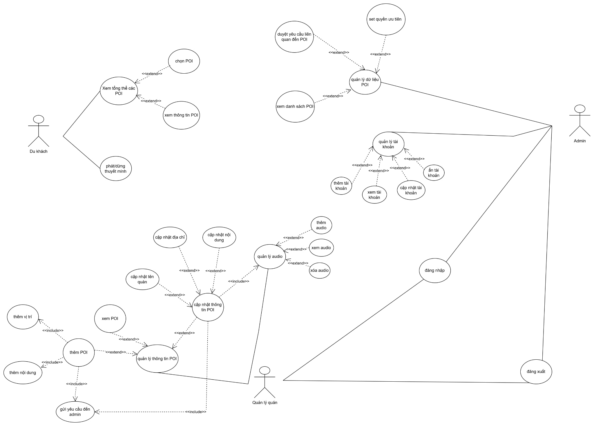
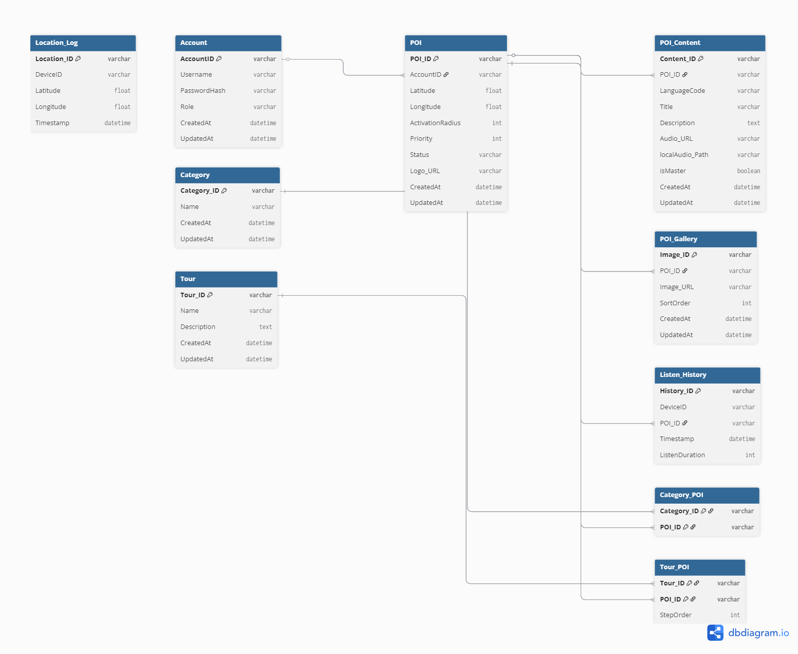
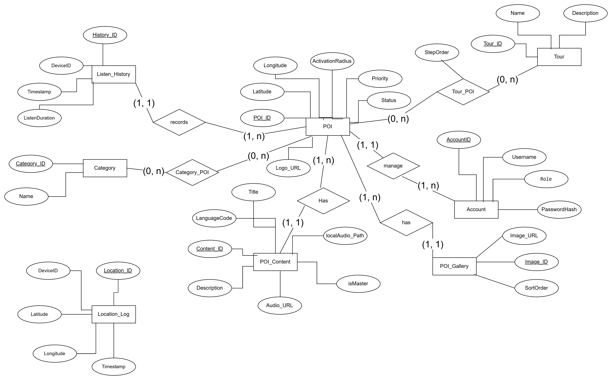
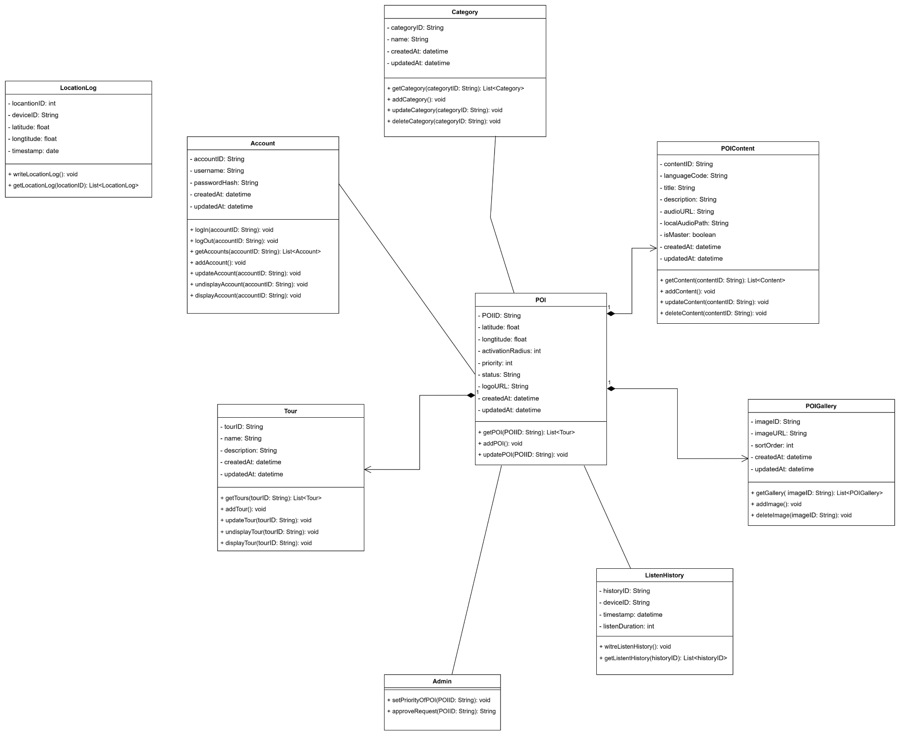

# 🎧 AudioGo — Hệ Thống Thuyết Minh Du Lịch Đa Ngôn Ngữ

> [!IMPORTANT]
> **Product Requirements Document (PRD) — Single Source of Truth**  
> *Dự án kỹ thuật số hóa Phố Ẩm Thực Vĩnh Khánh, Quận 4, TP.HCM*

---

## 📅 1. GIỚI THIỆU CHUNG (EXECUTIVE SUMMARY)

> [!NOTE]
> **AudioGo** là nền tảng số hóa trải nghiệm du lịch thông qua âm thanh (Audio-Guided Tour). Dự án áp dụng mô hình Client-Server để cung cấp chức năng phát âm thanh tự động dựa trên vị trí địa lý (Geofencing) trên Mobile App dành cho du khách, kết hợp với Web CMS quản trị đa ngôn ngữ và phân tích dữ liệu chuyên sâu dành cho Ban quản lý (Admin) và Chủ cửa hàng (POI Owner).

Mục tiêu tài liệu này (PRD) là đóng vai trò "nguồn sự thật duy nhất" (Single Source of Truth) chuẩn hóa mọi yêu cầu nghiệp vụ (Business Requirements), yêu cầu chức năng (Functional Requirements) và tiêu chí nghiệm thu (Acceptance Criteria) để phục vụ cho các tổ code/triển khai.

---

## 👥 2. PHÂN QUYỀN & ĐỐI TƯỢNG NGƯỜI DÙNG (USER ROLES)

| Vai trò (Actor) | Quyền hạn (Permissions) | Ghi chú |
| :--- | :--- | :--- |
| **Du khách (Guest)** | Tải App MAUI, xem bản đồ, quét QR, tự động nghe MP3 khi đi vào hàng rào ảo. | 100% người dùng cuối (End-user). Không yêu cầu đăng nhập. |
| **Quản lý quán (POI Owner)** | Đăng nhập Web CMS. Tạo mới/Sửa đổi POI. Upload audio, tự nhập text/yêu cầu hệ thống tự dịch. Ký đơn phê duyệt. | Tạo nội dung gốc (User-Generated Content). |
| **Admin Hệ thống** | Toàn quyền trên Web CMS. Phê duyệt (Approve/Reject) các yêu cầu từ Owner. Quản lý danh mục, Tour, Heatmap. | Giám sát chất lượng (Quality Control). |

> [!TIP]  
> **Biểu Đồ Usecase Tổng Quan:**  
> Dưới đây là bức tranh toàn cảnh về cách các thực thể tương tác với các hệ thống AudioGo.  
> 

---

## 📚 3. USER STORIES & YÊU CẦU CHỨC NĂNG (FUNCTIONAL REQUIREMENTS)

### Epic 1: Trải Nghiệm Khám Phá Của Du Khách (Mobile App MAUI)

**US 1.1 - Nhận diện Hàng Rào Ảo (Geofencing Audio)**
> [!NOTE]
> *Là một Du khách, tôi muốn ứng dụng tự động phát đoạn thuyết minh khi tôi đi bộ gần tới một địa điểm (POI), để tôi có thể nghe thông tin mà không cần nhìn vào màn hình điện thoại.*
- **FR (Yêu cầu chức năng):** 
  - Hệ thống Mobile xin quyền Location (Background & Foreground).
  - Sử dụng công thức Haversine để tính khoảng cách định kỳ.
  - Kích hoạt Audio khi `Current Distance <= POI Radius`.
- **AC (Tiêu chí nghiệm thu):**
  - [ ] App nhận diện thành công việc băng qua ranh giới ảo trong vòng tối đa 2-3 giây.
  - [ ] Audio tự động phát mượt mà (nếu đã được preload xuống SQLite).
  - [ ] Hệ thống ưu tiên phát POI có `Priority` cao nhất nếu du khách vô tình dẫm lên nhiều hàng rào cùng lúc.

**US 1.2 - Cơ Chế Chống Spam (Anti-spam / Cooldown)**
> [!NOTE]
> *Là một Du khách, tôi không muốn điện thoại cứ tắt bật lại cùng một đoạn âm thanh liên tục khi tôi đứng lưỡng lự ở sát ranh giới kích hoạt.*
- **FR:** Thiết lập bộ đếm Cooldown (vd: 5 phút) cho mỗi POI ID tính từ thời điểm audio bắt đầu phát.
- **AC:** 
  - [ ] Người dùng bước ra rồi bước vào lại trong vòng 5 phút -> Không phát lại audio.
  - [ ] Người dùng bước vào lại sau phút thứ 6 -> Phát lại audio bình thường.

**US 1.3 - Quét Mã QR Dự Phòng (QR Code Fallback) - Chua**
> [!NOTE]
> *Là một Du khách, tôi muốn có thể lấy camera quét mã QR trên băng rôn của quán để nghe âm thanh ngay lập tức, phòng trường hợp GPS nhảy sai vị trí.*
- **FR:** Nút "Scan QR" trên UI mở native camera. Decode ID và map trực tiếp với Local Database để lấy `audio_url`.
- **AC:**
  - [ ] Quét thành công, bỏ qua logic Geofencing và Cooldown, phát âm thanh ngay lập tức.

---

### Epic 2: Quản Lý Nội Dung và Ngôn Ngữ (Web CMS - POI Owner)

**US 2.1 - Thêm mới POI và Dịch thuật Nháp**
> [!NOTE]
> *Là Chủ Quán (POI Owner), tôi muốn tạo một điểm chuẩn và tự nhập mô tả ngôn ngữ gốc (Tiếng Việt) cũng như tự tag bản dịch tay (EN, KO...), để kiểm soát chính xác văn phong giới thiệu.*
- **FR:** Form tạo POI với URL Geolocation Google Maps API.
- **AC:**
  - [ ] Owner lưu nội dung dưới dạng Draft (Lưu nháp).
  - [ ] Owner có nút `Generate Audio Preview` gọi TTS test 1 đoạn ngắn xem ngữ điệu.

**US 2.2 - Quản Lý Audio Chủ Động**
> [!NOTE]
> *Là POI Owner, tôi muốn tự chèn file Audio thu âm bằng người thật (.mp3 chuyên nghiệp) thay vì dùng giọng máy đọc, để tăng tính hấp dẫn.*
- **FR:** Component Upload Media chấp nhận file chuẩn `.mp3` (Max size: 50MB).
- **AC:** 
  - [ ] Khi tồn tại file upload, đánh cờ bỏ qua bước tự động auto-gen Audio từ hệ thống.

**US 2.3 - Gửi Đơn Yêu Cầu Phê Duyệt (Approval Request)**
> [!NOTE]
> *Là POI Owner, tôi muốn gửi yêu cầu thay đổi nội dung lên Admin để được duyệt tự động hóa quy trình dịch thuật.*
- **FR:** Đẩy Record vào bảng `ApprovalRequests` với trạng thái `Pending`. POI bị locked trong khi chờ duyệt.

---

### Epic 3: Hệ Thống Phê Duyệt & Tự Động Hóa Dịch Thuật (Web CMS - Admin)

**US 3.1 - Kiểm duyệt và Phản hồi Đơn (Approval/Rejection)**
> [!NOTE]
> *Là Admin hệ thống, tôi muốn xem xét các đơn `ApprovalRequests` từ Owner, để quyết định duyệt đồng ý hoặc từ chối kèm lý do sửa đổi.*
- **FR:** Bảng hiển thị đơn Submit. Nút `Approve` (Xanh) và `Reject` (Đỏ).
- **AC:** 
  - [ ] Bấm `Reject`: Bắt buộc nhập text vào field `Feedback`. Trả form về Owner.
  - [ ] Bấm `Approve`: Lưu nội dung DB và kích hoạt Automation.

**US 3.2 - Tự Động Hóa Ngôn Ngữ & Âm Thanh (Automation Pipeline)**
> [!NOTE]
> *Là Admin, tôi mong muốn hệ thống tự động giải quyết các tệp âm thanh và phần dịch thuật còn khuyết ngay sau khi tôi bấm Duyệt, giúp tôi tiết kiệm thời gian vận hành.*
- **FR:** Ngay khi `Approve`, Backend Worker (Non-blocking) quét dữ liệu POI:
  1. Slot **đã upload (.mp3)**: Giữ nguyên, update URL Blob.
  2. Slot **có Text chưa Audio**: Gọi **Azure TTS** -> MP3 -> Azure Blob Storage.
  3. Slot **bỏ trống hoàn toàn**: Gọi **Azure Translator** dịch gốc -> Update DB -> Gọi **Azure TTS** -> MP3 -> Azure Blob Storage.
- **AC:**
  - [ ] POI mang trạng thái `Processing`. Xử lý xong -> `Published`. Async đồng bộ Mobile.

**US 3.3 - Giám Sát Phân Tích Dữ Liệu Địa Lý (Heatmap Analytics)**
> [!NOTE]
> *Là Admin, tôi muốn xem bản đồ nhiệt phân bổ hành vi đi lại và điểm dừng chân trên Phố Vĩnh Khánh, để hỗ trợ ra quyết định báo cáo địa phương.*
- **FR:** Tích hợp engine Leaflet JS trên trang CMS (React). Query các record `LocationLog` và `ListenHistory` để vẽ Heatmap.
- **AC:** 
  - [ ] Bản đồ hiển thị màu VÀNG/ĐỎ tại những vùng có mật độ Check-in/Listen cao trong 30 ngày.

---

## ⚙️ 4. YÊU CẦU PHI CHỨC NĂNG (NON-FUNCTIONAL REQUIREMENTS)

| Tiêu chí | Mô tả Yêu cầu (NFR) |
| :--- | :--- |
| **Bảo mật (Security)** | CMS áp dụng xác thực **JWT Bearer**. Table `ApprovalRequests` chống sửa đổi chéo nều không đúng OwnerID. |
| **Sẵn sàng (Availability)** | Mobile App ưu tiên **Offline-First** (SQLite). Dù rớt mạng 4G/5G, App vẫn chạy hệ toạ độ GPS Background và quét phát file Audio đã preload. |
| **Hiệu năng (Performance)** | Xử lý đa luồng Background Worker cho Azure Translation/TTS API mượt mà, không gián đoạn tương tác của Admin CMS. |
| **Công nghệ Maps** | Core Mobile dùng **Google Maps SDK** hiển thị điểm ảo. CMS quản trị web dùng **Leaflet JS** vẽ bản đồ nhiệt trực quan cao. |

---

## 🏗️ 5. TECHNOLOGY STACK & KIẾN TRÚC HỆ THỐNG CƠ SỞ CHUẨN

> [!TIP]
> *Sơ đồ CSDL và Sơ đồ Lớp này là cơ sở cấu trúc Code (Model Layers & Domain Entities) đóng vai trò xương sống cho việc truyền tải Geolocation và Auto-Translation Pipeline.*

1. **Backend (API Provider & Micro-tasks):**
   - ASP.NET Core 10 (C#) & Entity Framework Core 9.
   - Database Master: **SQL Server** (Lưu POI, User, Tour, Analytics, ApprovalRequests).
2. **Cloud Services (Azure Hub):**
   - **Azure AI Translator:** Dịch tự động các slot ngôn ngữ trống chưa hỗ trợ.
   - **Azure Text-To-Speech (TTS):** Chuyển đổi siêu tốc Text sang MP3 tĩnh.
   - **Azure Blob Storage:** Lưu file tĩnh băng thông lớn (`audiogo-audio`, `audiogo-images`).
3. **Frontend Client (Đối tác Vận hành):**
   - **Mobile App:** .NET MAUI cho iOS/Android gốc. 
   - **Web CMS:** React 19, Vite, shadcn/ui. 

### Sơ Đồ Cấu Trúc Cơ Sở Dữ Liệu (Schema & ERD)

### Sơ Đồ Tầng Lớp Nghiệp Vụ (Class Diagram)

---

## 🔗 6. DANH MỤC API ROUTES ĐỊNH TUYẾN (.NET CORE)

Cấu trúc giao thức REST trung tâm cho Front-End / MAUI giao tiếp Back-End:

### 🌟 API Phân Phối Cốt Lõi (App Lifecycle)
- `GET /api/poi/load-all`: Đồng bộ toàn bộ dữ liệu trạng thái `Published` xuống Local DB cho lần quét đầu cài App.
- `GET /api/poi/nearby`: Truy vấn bán kính (2dsphere) cho ra danh sách điểm cận kề theo vị trí GPS Realtime.

### 🌟 API Localization, Automation & Audio
- `POST /api/approval-requests/submit`: Owner POST Đơn xin duyệt POI (Kèm JSON văn bản, form-data Mp3).
- `POST /api/audio/tts`: Kích hoạt Stream Edge-TTS.
- `GET /api/admin/audio-tasks/stream`: Kết nối realtime Web (SSE) lấy % quá trình sinh Azure Audio / Translator nội bộ. 

### 🌟 API Phân Phối Pack Ngoại Tuyến (Offline Maps/Audio)
- `GET /api/audio/pack-manifest`: Load mảng file Mp3 tải về theo mã hệ ngôn ngữ.
- `POST /api/localizations/warmup`: Force build pre-cache cấu hình nén, để điện thoại khách tải cục bộ trước khi khởi hành ra cảng/vùng không Internet.
